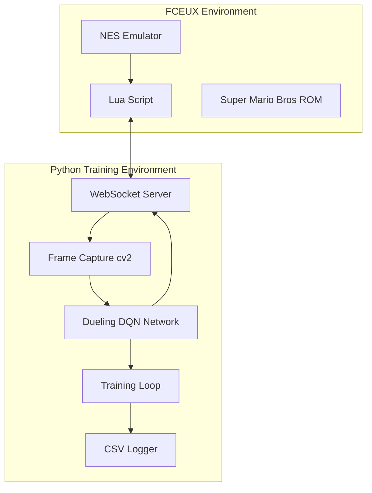

# Super Mario Bot V3

A sophisticated AI training system that teaches a neural network to play Super Mario Bros on NES using FCEUX emulator. The system features a Dueling DQN with 8-frame stacking, WebSocket communication between Lua and Python, and comprehensive reward system focused on level progression.

## 🎮 System Overview

This project implements a 2-part AI system:

1. **Lua Script (FCEUX side)**: Controls frame progression, extracts memory data, executes actions
2. **Python Script (Training side)**: GPU-accelerated PyTorch training with Dueling DQN, frame capture, and reward calculation

### Key Features

- **Dueling DQN Architecture**: Separate value and advantage streams for better learning
- **8-Frame Stacking**: Temporal context for understanding movement and animations
- **Hybrid Communication**: JSON for control messages, binary for high-frequency game data.  (might revise this to make the communiction more uniform, also binary is a pain)
- **Frame Synchronization**: Multi-layer sync strategy prevents desyncs
- **Comprehensive Reward System**: Level progression primary, survival/scoring secondary
- **Real-time Monitoring**: CSV logging and performance tracking

## 🏗️ Architecture



## 📋 Requirements

### Software Dependencies
- **FCEUX 2.6.4+**: NES emulator with Lua scripting support
- **Python 3.8+**: With PyTorch GPU support
- **CUDA 11.8+**: For GPU acceleration (recommended)

### Hardware Requirements
- **GPU**: NVIDIA GPU with 4GB+ VRAM (recommended)
- **RAM**: 8GB+ system memory
- **Storage**: 2GB+ free space for models and logs

### ROM Requirements
- Super Mario Bros (World).nes ROM file (user must provide legally)

## 🚀 Quick Start

### Windows Users (Recommended)
```batch
# 1. Clone repository
git clone https://github.com/your-username/Super-Mario-Bot-V3.git
cd Super-Mario-Bot-V3

# 2. Run automated installation
install.bat

# 3. Start training with easy launcher
run_training.bat
```

### Manual Installation
```bash
# 1. Clone repository
git clone https://github.com/your-username/Super-Mario-Bot-V3.git
cd Super-Mario-Bot-V3

# 2. Install Python dependencies
pip install -r requirements.txt

# 3. Install the package
pip install -e .

# 4. Validate system
python validate_system.py

# 5. Run comprehensive tests
python test_complete_system_integration.py
```

### Start Training
```bash
# Option 1: Use the training launcher (Windows)
run_training.bat

# Option 2: Direct command
python python/main.py train

# Option 3: With custom configuration
python python/main.py train --config examples/basic_training.yaml
```

### FCEUX Setup
1. Download FCEUX 2.6.4+ from http://fceux.com
2. Load Super Mario Bros ROM
3. Load Lua script: `File > Lua > New Lua Script Window > Browse > lua/mario_ai.lua`
4. Script should show "Waiting for connection..." message

## 📁 Project Structure

```
Super-Mario-Bot-V3/
├── docs/                    # Comprehensive documentation
├── config/                  # YAML configuration files
├── lua/                     # FCEUX Lua scripts
├── python/                  # Python training system
│   ├── core/               # Training components
│   ├── communication/      # WebSocket handling
│   ├── game/               # Game-specific logic
│   ├── neural/             # Neural network components
│   └── utils/              # Utility modules
├── data/                   # Models, logs, replays
└── scripts/                # Utility scripts
```

## 🧠 Neural Network Architecture

### Dueling DQN with 8-Frame Stacking
- **Input**: 8 consecutive 84x84 grayscale frames + 12-dimensional state vector
- **Convolutional Layers**: 3 layers for spatial feature extraction
- **Dueling Streams**: Separate value and advantage estimation
- **Output**: Q-values for 12 possible actions

### Action Space
```
0: No Action          6: Run/Fire
1: Right             7: Right + Run
2: Left              8: Left + Run
3: Jump              9: Right + Jump + Run (Forward Jump)
4: Right + Jump      10: Left + Jump + Run
5: Left + Jump       11: Crouch/Down
```

## 🎯 Reward System

### Primary Objectives (70%)
- **Level Progress**: +1 per pixel rightward, +10x for new maximum distance
- **Level Completion**: +5000 base + time bonus
- **Milestone Bonuses**: +100-500 for 25%, 50%, 75%, 90% completion

### Secondary Objectives (25%)
- **Power-ups**: +200 (big), +400 (fire)
- **Enemy Elimination**: +100 per enemy
- **Coin Collection**: +50 per coin
- **Score Increase**: +0.01 per point

### Penalties (5%)
- **Death**: -1000 (adjusted by cause and lives remaining)
- **Backward Movement**: -0.5 per pixel
- **Stuck Behavior**: -1 per frame after 60 frames

## 📊 Training Configuration

### Default Hyperparameters
```yaml
learning_rate: 0.00025
batch_size: 32
replay_buffer_size: 100000
epsilon_start: 1.0
epsilon_end: 0.01
epsilon_decay: 0.995
target_update_frequency: 1000
max_episodes: 50000
```

### Curriculum Learning
1. **World 1-1 Mastery**: Focus on completing first level
2. **Performance Threshold**: 80% completion rate over 100 episodes
3. **Progressive Expansion**: Add more levels once mastery achieved

## 📈 Monitoring and Logging

### Real-time Metrics
- Episode rewards and completion rates
- Neural network loss and Q-values
- Frame synchronization quality
- Memory usage and processing times

### CSV Logging
```csv
episode,step,reward,total_reward,epsilon,loss,mario_x_max,level_completed,death_cause,processing_time,sync_quality
```

### TensorBoard Integration
```bash
tensorboard --logdir data/logs/tensorboard
```

## 🔧 Configuration

### Training Parameters
Edit [`config/training_config.yaml`](config/training_config.yaml) to adjust:
- Learning rates and batch sizes
- Exploration parameters
- Training schedule
- Optimization settings

### Network Architecture
Edit [`config/network_config.yaml`](config/network_config.yaml) to modify:
- Layer sizes and configurations
- Dropout rates
- Activation functions

### Game Settings
Edit [`config/game_config.yaml`](config/game_config.yaml) to configure:
- Memory address mappings
- Action definitions
- ROM path settings

## 🐛 Troubleshooting

### Common Issues

#### WebSocket Connection Failed
```bash
# Check if Python server is running
netstat -an | grep 8765

# Verify firewall settings
# Ensure FCEUX has network permissions
```

#### Frame Desync Detected
```bash
# Check logs for sync quality metrics
tail -f data/logs/debug_logs/debug_*.log

# Adjust sync parameters in config
```

#### GPU Memory Issues
```bash
# Reduce batch size in training_config.yaml
batch_size: 16  # Instead of 32

# Enable gradient accumulation
accumulation_steps: 2
```

#### Poor Training Performance
```bash
# Check reward distribution
python scripts/visualize_training.py

# Adjust reward weights in reward_calculator.py
# Verify memory address readings
```

## 📚 Documentation

Comprehensive documentation available in [`docs/`](docs/):

- [**Architecture Overview**](docs/architecture.md): System design and component interaction
- [**Communication Protocol**](docs/communication-protocol.md): WebSocket message formats
- [**Memory Addresses**](docs/memory-addresses.md): NES memory mapping reference
- [**Data Flow**](docs/data-flow.md): End-to-end data processing pipeline
- [**Frame Synchronization**](docs/frame-synchronization.md): Sync strategy and desync prevention
- [**Reward System**](docs/reward-system.md): Detailed reward calculation logic
- [**Neural Network**](docs/neural-network-architecture.md): DQN architecture specifications
- [**Project Structure**](docs/project-structure-implementation.md): Implementation guide

## 🤝 Contributing

1. Fork the repository
2. Create a feature branch (`git checkout -b feature/amazing-feature`)
3. Commit your changes (`git commit -m 'Add amazing feature'`)
4. Push to the branch (`git push origin feature/amazing-feature`)
5. Open a Pull Request

## 📄 License

This project is licensed under the MIT License - see the [LICENSE](LICENSE) file for details.

## 🙏 Acknowledgments

- FCEUX development team for excellent NES emulation and Lua support
- PyTorch team for the deep learning framework
- Super Mario Bros speedrunning community for game mechanics insights
- OpenAI and DeepMind for foundational DQN research

## 📞 Support

- **Issues**: [GitHub Issues](https://github.com/your-username/Super-Mario-Bot-V3/issues)
- **Discussions**: [GitHub Discussions](https://github.com/your-username/Super-Mario-Bot-V3/discussions)
- **Documentation**: [Project Wiki](https://github.com/your-username/Super-Mario-Bot-V3/wiki)

---

**Note**: This project is for educational and research purposes. Users must provide their own legally obtained ROM files.
