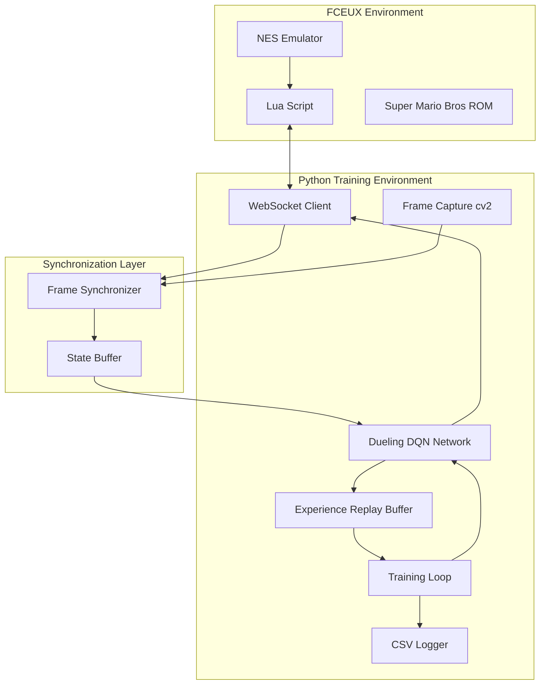
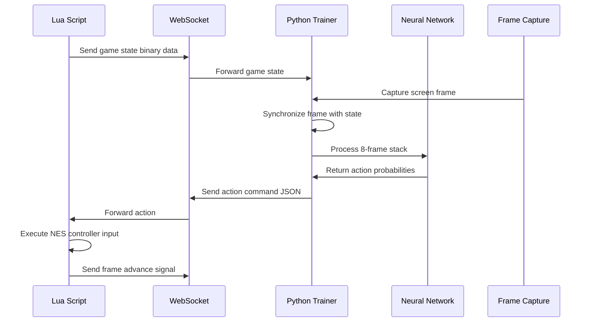

# Super Mario Bros AI Training System Architecture

## System Overview

This system consists of two main components that communicate via WebSocket to train a neural network to play Super Mario Bros on NES using the FCEUX emulator.

## High-Level Architecture

## Component Interaction Flow

## Data Flow Architecture

```mermaid
graph LR
    subgraph MEMORY[NES Memory]
        MARIO_POS[Mario Position]
        ENEMIES[Enemy Positions]
        LEVEL_DATA[Level Layout]
        GAME_STATE[Game Variables]
    end
    
    subgraph EXTRACTION[Feature Extraction]
        MEM_READ[Memory Reader]
        FEATURE_ENG[Feature Engineering]
        NORM[Normalization]
    end
    
    subgraph NEURAL[Neural Network]
        FRAME_STACK[8-Frame Stack]
        CONV_LAYERS[Convolutional Layers]
        DUELING[Dueling Architecture]
        VALUE[Value Stream]
        ADVANTAGE[Advantage Stream]
        Q_VALUES[Q-Values]
    end
    
    subgraph CONTROL[Game Control]
        ACTION_SEL[Action Selection]
        CONTROLLER[NES Controller]
    end
    
    MEMORY --> EXTRACTION
    EXTRACTION --> FRAME_STACK
    FRAME_STACK --> CONV_LAYERS
    CONV_LAYERS --> DUELING
    DUELING --> VALUE
    DUELING --> ADVANTAGE
    VALUE --> Q_VALUES
    ADVANTAGE --> Q_VALUES
    Q_VALUES --> ACTION_SEL
    ACTION_SEL --> CONTROLLER
```

## Synchronization Strategy

The system uses a multi-layered synchronization approach to prevent desyncs:

1. **Frame-Level Sync**: Lua script controls frame advancement and waits for Python acknowledgment
2. **State Buffer**: Python maintains a circular buffer of recent game states
3. **Timestamp Matching**: Each frame capture is timestamped and matched with corresponding game state
4. **Heartbeat Protocol**: Regular ping/pong messages ensure connection health

## Key Design Principles

- **Separation of Concerns**: Lua handles emulator control, Python handles AI training
- **Hybrid Communication**: JSON for control messages, binary for high-frequency data
- **Robust Synchronization**: Multiple layers prevent frame/state misalignment
- **Modular Architecture**: Each component can be developed and tested independently
- **Performance Optimization**: Binary protocols and GPU acceleration where needed