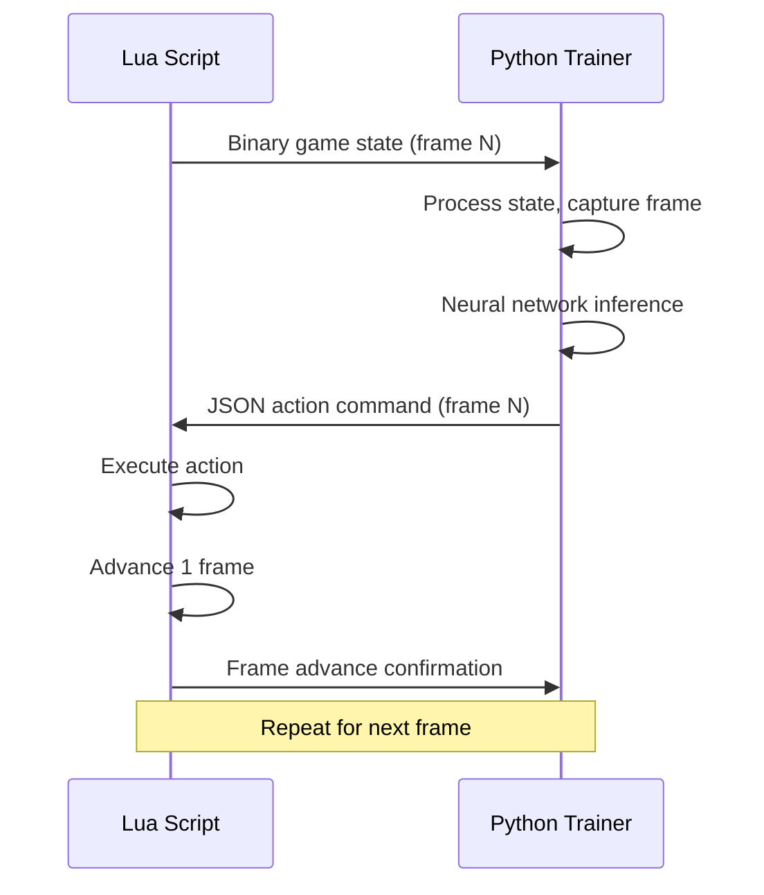

# WebSocket Communication Protocol

## Overview

The system uses a hybrid communication protocol between the Lua script (FCEUX) and Python trainer:
- **JSON messages** for control, configuration, and debug information
- **Binary messages** for high-frequency game state data

## Connection Setup

### Initial Handshake
1. Python starts WebSocket server on `localhost:8765`
2. Lua script connects and sends initialization message
3. Python responds with configuration acknowledgment
4. Training loop begins

## Message Types

### 1. Control Messages (JSON)

#### Connection Initialization
**Lua → Python**
```json
{
  "type": "init",
  "timestamp": 1634567890123,
  "fceux_version": "2.6.4",
  "rom_name": "Super Mario Bros (World).nes",
  "protocol_version": "1.0"
}
```

**Python → Lua**
```json
{
  "type": "init_ack",
  "timestamp": 1634567890124,
  "status": "ready",
  "training_mode": "world_1_1",
  "frame_skip": 4
}
```

#### Training Control
**Python → Lua**
```json
{
  "type": "training_control",
  "command": "start|pause|reset|stop",
  "episode_id": 12345,
  "reset_to_level": "1-1"
}
```

#### Episode Management
**Lua → Python**
```json
{
  "type": "episode_event",
  "event": "death|level_complete|time_up|manual_reset",
  "episode_id": 12345,
  "final_score": 2400,
  "final_x_position": 3168,
  "time_remaining": 245
}
```

#### Heartbeat/Ping
**Bidirectional**
```json
{
  "type": "ping",
  "timestamp": 1634567890125
}
```

```json
{
  "type": "pong",
  "timestamp": 1634567890126,
  "latency_ms": 1
}
```

### 2. Action Commands (JSON)

**Python → Lua**
```json
{
  "type": "action",
  "frame_id": 98765,
  "buttons": {
    "A": true,
    "B": false,
    "up": false,
    "down": false,
    "left": false,
    "right": true,
    "start": false,
    "select": false
  },
  "hold_frames": 1
}
```

### 3. Game State Data (Binary)

#### Binary Message Structure
```
Header (8 bytes):
- Message Type (1 byte): 0x01 = game_state
- Frame ID (4 bytes): Unique frame identifier
- Data Length (2 bytes): Length of payload
- Checksum (1 byte): Simple XOR checksum

Payload (Variable length):
- Mario Data (16 bytes)
- Enemy Data (32 bytes max, 4 bytes per enemy)
- Level Data (64 bytes)
- Game Variables (16 bytes)
```

#### Mario Data Block (16 bytes)
```
Offset | Size | Description
-------|------|------------
0      | 2    | X Position (world coordinates)
2      | 2    | Y Position (world coordinates)
4      | 2    | X Velocity
6      | 2    | Y Velocity
8      | 1    | Power State (0=small, 1=big, 2=fire)
9      | 1    | Animation State
10     | 1    | Direction Facing (0=left, 1=right)
11     | 1    | On Ground Flag
12     | 1    | Lives Remaining
13     | 1    | Invincibility Timer
14     | 2    | Reserved
```

#### Enemy Data Block (32 bytes, up to 8 enemies)
```
Per Enemy (4 bytes):
Offset | Size | Description
-------|------|------------
0      | 1    | Enemy Type (0=none, 1=goomba, 2=koopa, etc.)
1      | 1    | X Position (screen relative)
2      | 1    | Y Position (screen relative)
3      | 1    | State Flags (direction, alive, etc.)
```

#### Level Data Block (64 bytes)
```
Offset | Size | Description
-------|------|------------
0      | 2    | Camera X Position
2      | 1    | World Number
3      | 1    | Level Number
4      | 4    | Score (BCD encoded)
8      | 2    | Time Remaining
10     | 2    | Coins Collected
12     | 52   | Level Layout (compressed tile data)
```

#### Game Variables Block (16 bytes)
```
Offset | Size | Description
-------|------|------------
0      | 1    | Game State (0=playing, 1=paused, 2=game_over)
1      | 1    | Level Progress Percentage
2      | 2    | Distance to Flag
4      | 4    | Frame Counter
8      | 4    | Episode Timer
12     | 4    | Reserved
```

## Frame Synchronization Protocol

### Synchronization Flow


### Frame Synchronization Messages

**Lua → Python (Frame Advance)**
```json
{
  "type": "frame_advance",
  "frame_id": 98766,
  "timestamp": 1634567890127
}
```

**Python → Lua (Frame Acknowledgment)**
```json
{
  "type": "frame_ack",
  "frame_id": 98766,
  "ready_for_next": true
}
```

## Error Handling

### Connection Errors
```json
{
  "type": "error",
  "error_code": "CONNECTION_LOST",
  "message": "WebSocket connection interrupted",
  "timestamp": 1634567890128
}
```

### Protocol Errors
```json
{
  "type": "error",
  "error_code": "INVALID_MESSAGE",
  "message": "Unknown message type received",
  "invalid_data": "...",
  "timestamp": 1634567890129
}
```

### Synchronization Errors
```json
{
  "type": "error",
  "error_code": "FRAME_DESYNC",
  "message": "Frame ID mismatch detected",
  "expected_frame": 98765,
  "received_frame": 98763,
  "timestamp": 1634567890130
}
```

## Performance Considerations

### Message Frequency
- **Game State**: 60 Hz (every frame)
- **Actions**: 60 Hz (every frame)
- **Control Messages**: As needed
- **Heartbeat**: 1 Hz

### Bandwidth Usage
- Binary game state: ~128 bytes @ 60 Hz = ~7.5 KB/s
- JSON actions: ~200 bytes @ 60 Hz = ~12 KB/s
- Total: ~20 KB/s sustained

### Latency Requirements
- Target: <16ms round-trip (1 frame at 60 FPS)
- Maximum acceptable: 33ms (2 frames)
- Timeout for responses: 100ms

## Implementation Notes

### Binary Encoding
- All multi-byte integers in little-endian format
- Signed integers use two's complement
- BCD encoding for score display compatibility

### JSON Encoding
- UTF-8 encoding
- Compact format (no pretty printing)
- Timestamp in milliseconds since epoch

### WebSocket Configuration
- Protocol: `ws://` (not `wss://` for local development)
- Port: 8765 (configurable)
- Buffer size: 64KB
- Compression: Disabled for latency