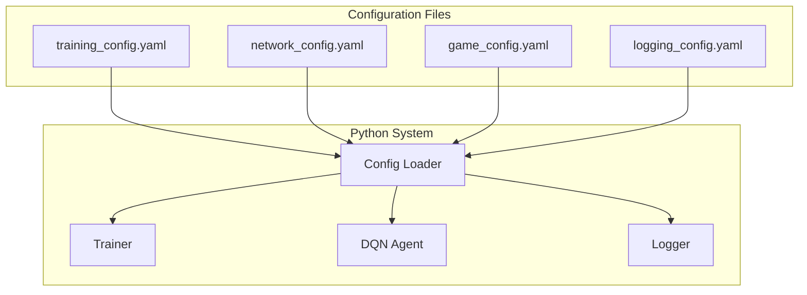

# Configuration Files Specification

## Overview

This document specifies all configuration files for the Super Mario Bros AI training system. The configuration is split into multiple YAML files for modularity and ease of management.

## Configuration Architecture



## Configuration Files

### 1. Training Configuration (`config/training_config.yaml`)

Controls all training-related hyperparameters and schedules.

```yaml
# Training Configuration for Super Mario Bros AI
# Hyperparameters for Dueling DQN training

training:
  # Core Learning Parameters
  learning_rate: 0.00025          # Adam optimizer learning rate
  batch_size: 32                  # Training batch size
  replay_buffer_size: 100000      # Experience replay buffer capacity
  target_update_frequency: 1000   # Target network update interval (episodes)
  
  # Exploration Strategy (Epsilon-Greedy)
  epsilon_start: 1.0              # Initial exploration rate
  epsilon_end: 0.01               # Final exploration rate
  epsilon_decay: 0.995            # Decay rate per episode
  epsilon_decay_type: "exponential" # "exponential" or "linear"
  
  # Training Schedule
  max_episodes: 50000             # Maximum training episodes
  max_steps_per_episode: 18000    # Max steps per episode (5 min at 60 FPS)
  warmup_episodes: 1000           # Episodes before training starts
  save_frequency: 1000            # Model checkpoint save interval
  evaluation_frequency: 500       # Evaluation run interval
  
  # Optimization Settings
  optimizer: "Adam"               # Optimizer type
  loss_function: "Huber"          # Loss function ("Huber", "MSE")
  gradient_clipping: 10.0         # Gradient clipping threshold
  gamma: 0.99                     # Discount factor
  
  # Advanced Training Options
  double_dqn: true                # Enable Double DQN
  prioritized_replay: false       # Enable prioritized experience replay
  noisy_networks: false           # Enable noisy networks for exploration
  
  # Curriculum Learning
  curriculum:
    enabled: true
    phases:
      - name: "exploration"
        episodes: 10000
        epsilon_override: 0.8
        reward_scaling: 1.2
      - name: "optimization" 
        episodes: 30000
        epsilon_override: null
        reward_scaling: 1.0
      - name: "mastery"
        episodes: 10000
        epsilon_override: 0.05
        reward_scaling: 0.9

# Performance and Resource Management
performance:
  # GPU Settings
  device: "cuda"                  # "cuda", "cpu", or "auto"
  mixed_precision: true           # Enable automatic mixed precision
  compile_model: true             # Use torch.compile for optimization
  
  # Memory Management
  pin_memory: true                # Pin memory for faster GPU transfer
  num_workers: 4                  # DataLoader worker processes
  prefetch_factor: 2              # Prefetch batches per worker
  
  # Monitoring
  profile_training: false         # Enable PyTorch profiler
  log_gpu_memory: true           # Log GPU memory usage
  
# Checkpointing and Recovery
checkpointing:
  auto_save: true                 # Automatic checkpoint saving
  keep_best_n: 5                 # Keep N best performing checkpoints
  save_optimizer_state: true     # Save optimizer state in checkpoints
  compression: true               # Compress checkpoint files
```

### 2. Network Configuration (`config/network_config.yaml`)

Defines the neural network architecture and layer specifications.

```yaml
# Neural Network Architecture Configuration
# Dueling DQN with 8-frame stacking specifications

network:
  # Architecture Type
  architecture: "dueling_dqn"     # Network architecture type
  
  # Input Specifications
  frame_stack_size: 8             # Number of frames to stack
  frame_size: [84, 84]            # Frame dimensions (height, width)
  state_vector_size: 12           # Game state vector dimensions
  num_actions: 12                 # Number of possible actions
  
  # Convolutional Layers
  conv_layers:
    - name: "conv1"
      filters: 32                 # Number of output channels
      kernel_size: 8              # Kernel size
      stride: 4                   # Stride
      padding: 2                  # Padding
      activation: "relu"          # Activation function
      batch_norm: false           # Batch normalization
      
    - name: "conv2"
      filters: 64
      kernel_size: 4
      stride: 2
      padding: 1
      activation: "relu"
      batch_norm: false
      
    - name: "conv3"
      filters: 64
      kernel_size: 3
      stride: 1
      padding: 1
      activation: "relu"
      batch_norm: false
  
  # Feature Fusion Layer
  fusion_layer:
    hidden_size: 512              # Hidden layer size
    activation: "relu"            # Activation function
    dropout: 0.3                  # Dropout rate
    batch_norm: false             # Batch normalization
  
  # Dueling Architecture Streams
  dueling_streams:
    # Value Stream
    value_stream:
      hidden_layers: [256]        # Hidden layer sizes
      activation: "relu"          # Activation function
      dropout: 0.3                # Dropout rate
      output_size: 1              # Single value output
      
    # Advantage Stream  
    advantage_stream:
      hidden_layers: [256]        # Hidden layer sizes
      activation: "relu"          # Activation function
      dropout: 0.3                # Dropout rate
      output_size: 12             # One per action
  
  # Weight Initialization
  initialization:
    method: "kaiming_normal"      # "kaiming_normal", "xavier_uniform", etc.
    nonlinearity: "relu"          # For kaiming initialization
    bias_init: 0.0                # Bias initialization value
  
  # Regularization
  regularization:
    weight_decay: 0.0001          # L2 regularization
    spectral_norm: false          # Spectral normalization
    gradient_penalty: false       # Gradient penalty
    
# Model Variants (for experimentation)
variants:
  # Smaller model for faster training
  small:
    conv_layers:
      - {filters: 16, kernel_size: 8, stride: 4, padding: 2}
      - {filters: 32, kernel_size: 4, stride: 2, padding: 1}
    fusion_layer: {hidden_size: 256}
    dueling_streams:
      value_stream: {hidden_layers: [128]}
      advantage_stream: {hidden_layers: [128]}
      
  # Larger model for maximum performance
  large:
    conv_layers:
      - {filters: 64, kernel_size: 8, stride: 4, padding: 2}
      - {filters: 128, kernel_size: 4, stride: 2, padding: 1}
      - {filters: 128, kernel_size: 3, stride: 1, padding: 1}
    fusion_layer: {hidden_size: 1024}
    dueling_streams:
      value_stream: {hidden_layers: [512, 256]}
      advantage_stream: {hidden_layers: [512, 256]}
```

### 3. Game Configuration (`config/game_config.yaml`)

Game-specific settings including memory addresses and action mappings.

```yaml
# Game Configuration for Super Mario Bros
# Memory addresses, actions, and game-specific settings

game:
  # ROM and Emulator Settings
  rom_path: "roms/Super Mario Bros (World).nes"
  emulator: "fceux"
  target_world: 1                 # World to train on
  target_level: 1                 # Level to train on
  
  # Level Specifications
  level_specs:
    world_1_1:
      length: 3168                # Level length in pixels
      time_limit: 400             # Time limit in seconds
      completion_x: 3168          # X position for completion
      
  # Memory Address Mappings
  memory_addresses:
    # Mario Position and Movement
    mario_x_world_low: 0x0086     # Mario X position (world, low byte)
    mario_x_world_high: 0x03AD    # Mario X position (world, high byte)
    mario_y_world: 0x03B8         # Mario Y position (world)
    mario_x_screen: 0x006D        # Mario X position (screen)
    mario_y_screen: 0x00CE        # Mario Y position (screen)
    mario_x_velocity: 0x0057      # Mario X velocity
    mario_y_velocity: 0x009F      # Mario Y velocity
    mario_direction: 0x0045       # Mario facing direction
    mario_on_ground: 0x001D       # Mario on ground flag
    
    # Mario State
    power_state: 0x0756           # Mario power state (0=small, 1=big, 2=fire)
    lives: 0x075A                 # Lives remaining
    invincibility_timer: 0x079E   # Invincibility timer
    star_timer: 0x0770            # Star power timer
    animation_state: 0x0079       # Mario animation state
    crouching: 0x001E             # Mario crouching flag
    
    # Score and Collectibles
    score_100k: 0x07DD            # Score (100,000s digit)
    score_10k: 0x07DE             # Score (10,000s digit)
    score_1k: 0x07DF              # Score (1,000s digit)
    score_100: 0x07E0             # Score (100s digit)
    score_10: 0x07E1              # Score (10s digit)
    score_1: 0x07E2               # Score (1s digit)
    coins_10: 0x075E              # Coins (tens digit)
    coins_1: 0x075D               # Coins (ones digit)
    
    # Level and Time
    world_number: 0x075F          # Current world
    level_number: 0x0760          # Current level
    timer_100: 0x071A             # Timer (hundreds digit)
    timer_10: 0x071B              # Timer (tens digit)
    timer_1: 0x071C               # Timer (ones digit)
    
    # Camera and Screen
    screen_x_low: 0x0086          # Screen X position (low byte)
    screen_x_high: 0x03AD         # Screen X position (high byte)
    screen_y: 0x00B5              # Screen Y position
    vertical_scroll: 0x0725       # Vertical scroll
    
    # Enemies (8 slots)
    enemy_x_screen: [0x0087, 0x0088, 0x0089, 0x008A, 0x008B, 0x008C, 0x008D, 0x008E]
    enemy_y_screen: [0x00CF, 0x00D0, 0x00D1, 0x00D2, 0x00D3, 0x00D4, 0x00D5, 0x00D6]
    enemy_type: [0x0014, 0x0015, 0x0016, 0x0017, 0x0018, 0x0019, 0x001A, 0x001B]
    enemy_state: [0x001C, 0x001D, 0x001E, 0x001F, 0x0020, 0x0021, 0x0022, 0x0023]
    
    # Game State
    game_engine_state: 0x0770     # Game engine state
    player_state: 0x001D          # Player state
    game_mode: 0x0E               # Game mode
    level_complete_flag: 0x0772   # Level completion flag
    
    # Controller Input
    controller_1_input: 0x00F7    # Controller 1 current input
    controller_1_previous: 0x00F6 # Controller 1 previous input

  # Action Space Definition
  actions:
    0:
      name: "no_action"
      description: "No input"
      buttons: {}
      
    1:
      name: "right"
      description: "Move right"
      buttons: {right: true}
      
    2:
      name: "left" 
      description: "Move left"
      buttons: {left: true}
      
    3:
      name: "jump"
      description: "Jump"
      buttons: {A: true}
      
    4:
      name: "right_jump"
      description: "Move right and jump"
      buttons: {right: true, A: true}
      
    5:
      name: "left_jump"
      description: "Move left and jump"
      buttons: {left: true, A: true}
      
    6:
      name: "run"
      description: "Run/Fire"
      buttons: {B: true}
      
    7:
      name: "right_run"
      description: "Move right and run"
      buttons: {right: true, B: true}
      
    8:
      name: "left_run"
      description: "Move left and run"
      buttons: {left: true, B: true}
      
    9:
      name: "right_jump_run"
      description: "Forward jumping (right + jump + run)"
      buttons: {right: true, A: true, B: true}
      
    10:
      name: "left_jump_run"
      description: "Left jump with run"
      buttons: {left: true, A: true, B: true}
      
    11:
      name: "crouch"
      description: "Crouch/Down"
      buttons: {down: true}

# Reward System Configuration
rewards:
  # Primary Rewards (Level Progress)
  primary:
    forward_movement_multiplier: 1.0      # Reward per pixel forward
    milestone_multiplier: 10.0            # Bonus for new max distance
    completion_reward: 5000               # Level completion reward
    time_bonus_multiplier: 2.0            # Time remaining bonus
    progress_bonuses: [100, 200, 300, 500] # Milestone bonuses
    
  # Secondary Rewards (Survival/Scoring)
  secondary:
    powerup_rewards: [0, 200, 400]        # Small, big, fire Mario
    enemy_kill_reward: 100                # Base enemy elimination reward
    coin_reward: 50                       # Coin collection reward
    score_multiplier: 0.01                # Score increase multiplier
    
  # Penalties
  penalties:
    death_penalty: -1000                  # Death penalty
    backward_movement_multiplier: -0.5    # Backward movement penalty
    stuck_penalty_per_frame: -1.0         # Stuck behavior penalty
    stuck_threshold_frames: 60            # Frames before stuck penalty
    
  # Reward Shaping
  shaping:
    curriculum_enabled: true              # Enable curriculum learning
    adaptive_scaling: true                # Adaptive reward scaling
    reward_clipping: [-2000, 2000]        # Reward clipping range
```

### 4. Logging Configuration (`config/logging_config.yaml`)

Comprehensive logging setup for training monitoring and debugging.

```yaml
# Logging Configuration
# CSV logging, debug logs, and performance monitoring

logging:
  # General Logging Settings
  level: "INFO"                   # Logging level (DEBUG, INFO, WARNING, ERROR)
  format: "%(asctime)s - %(name)s - %(levelname)s - %(message)s"
  date_format: "%Y-%m-%d %H:%M:%S"
  
  # File Logging
  files:
    # Training Performance Log (CSV)
    training_log:
      path: "data/logs/training_logs/training_{timestamp}.csv"
      enabled: true
      level: "INFO"
      
    # Debug Log (Text)
    debug_log:
      path: "data/logs/debug_logs/debug_{timestamp}.log"
      enabled: true
      level: "DEBUG"
      max_size_mb: 100            # Max file size before rotation
      backup_count: 5             # Number of backup files
      
    # Performance Metrics Log (CSV)
    performance_log:
      path: "data/logs/training_logs/performance_{timestamp}.csv"
      enabled: true
      level: "INFO"
      
    # Error Log (Text)
    error_log:
      path: "data/logs/debug_logs/error_{timestamp}.log"
      enabled: true
      level: "ERROR"
  
  # Console Logging
  console:
    enabled: true
    level: "INFO"
    colored: true                 # Colored console output
    
  # CSV Logging Schemas
  csv_schemas:
    # Main Training Log
    training:
      columns:
        - episode                 # Episode number
        - step                    # Step within episode
        - reward                  # Step reward
        - total_reward            # Episode total reward
        - epsilon                 # Current exploration rate
        - loss                    # Neural network loss
        - q_value_mean            # Mean Q-value
        - mario_x_max             # Maximum X position reached
        - mario_x_final           # Final X position
        - level_completed         # Boolean: level completed
        - death_cause             # Cause of death (if applicable)
        - lives_remaining         # Lives at episode end
        - score                   # Final score
        - coins_collected         # Coins collected
        - enemies_killed          # Enemies eliminated
        - time_remaining          # Time remaining at end
        - episode_duration        # Episode duration (seconds)
        - processing_time         # Processing time per step (ms)
        - sync_quality            # Frame sync quality (ms)
        - timestamp               # Timestamp
        
    # Performance Metrics Log
    performance:
      columns:
        - episode                 # Episode number
        - fps                     # Frames per second
        - memory_usage_mb         # Memory usage (MB)
        - gpu_memory_mb           # GPU memory usage (MB)
        - cpu_percent             # CPU usage percentage
        - network_inference_ms    # Neural network inference time
        - frame_processing_ms     # Frame processing time
        - websocket_latency_ms    # WebSocket communication latency
        - replay_buffer_size      # Current replay buffer size
        - learning_rate           # Current learning rate
        - timestamp               # Timestamp
        
    # Synchronization Quality Log
    sync_quality:
      columns:
        - episode                 # Episode number
        - step                    # Step number
        - frame_id                # Frame ID
        - sync_delay_ms           # Synchronization delay
        - desync_events           # Number of desync events
        - recovery_time_ms        # Time to recover from desync
        - timestamp               # Timestamp
  
  # TensorBoard Integration
  tensorboard:
    enabled: true
    log_dir: "data/logs/tensorboard"
    update_frequency: 100         # Log every N steps
    
    # Metrics to log
    metrics:
      scalars:
        - "reward/episode_total"
        - "reward/step_mean"
        - "training/loss"
        - "training/epsilon"
        - "training/learning_rate"
        - "game/mario_x_max"
        - "game/level_completion_rate"
        - "performance/fps"
        - "performance/memory_usage"
        
      histograms:
        - "network/q_values"
        - "network/gradients"
        - "reward/distribution"
        
      images:
        - "game/current_frame"
        - "game/frame_stack"
  
  # Monitoring and Alerts
  monitoring:
    # Performance Alerts
    alerts:
      low_fps:
        threshold: 30             # Alert if FPS drops below 30
        enabled: true
        
      high_memory:
        threshold: 8000           # Alert if memory usage > 8GB
        enabled: true
        
      training_stalled:
        threshold: 1000           # Alert if no improvement for N episodes
        enabled: true
        
      desync_rate:
        threshold: 0.05           # Alert if desync rate > 5%
        enabled: true
    
    # Health Checks
    health_checks:
      websocket_connection: true  # Monitor WebSocket connection
      gpu_availability: true     # Monitor GPU availability
      disk_space: true           # Monitor disk space
      
  # Log Retention
  retention:
    training_logs_days: 30        # Keep training logs for 30 days
    debug_logs_days: 7            # Keep debug logs for 7 days
    performance_logs_days: 14     # Keep performance logs for 14 days
    tensorboard_logs_days: 60     # Keep TensorBoard logs for 60 days
    
  # Compression and Archival
  archival:
    compress_old_logs: true       # Compress logs older than 1 day
    archive_threshold_days: 7     # Archive logs older than 7 days
    archive_location: "data/logs/archive"
```

## Configuration Loading and Validation

### ✅ Implemented Configuration System

The configuration system has been fully implemented with comprehensive validation and loading capabilities:

#### Configuration Loader ([`python/utils/config_loader.py`](../python/utils/config_loader.py))
- **Multi-file Loading**: Automatically loads all YAML configuration files
- **Validation**: Comprehensive parameter validation and type checking
- **Error Handling**: Graceful handling of missing or invalid configurations
- **Environment Variables**: Support for environment variable overrides
- **Default Values**: Fallback to sensible defaults when configurations are missing

#### Example Configurations

The system includes ready-to-use configuration examples:

- **[`examples/basic_training.yaml`](../examples/basic_training.yaml)**: Simple training setup for beginners
- **[`examples/advanced_training.yaml`](../examples/advanced_training.yaml)**: Advanced configuration with all features enabled
- **[`config/training_config.yaml`](../config/training_config.yaml)**: Default training parameters
- **[`config/network_config.yaml`](../config/network_config.yaml)**: Neural network architecture
- **[`config/game_config.yaml`](../config/game_config.yaml)**: Game-specific settings
- **[`config/logging_config.yaml`](../config/logging_config.yaml)**: Logging configuration

#### Configuration Validation

The system includes comprehensive validation through:

- **[`validate_system.py`](../validate_system.py)**: Complete system validation including configuration files
- **[`examples/quick_test.py`](../examples/quick_test.py)**: Quick configuration validation
- **Built-in validation**: Automatic validation during configuration loading

#### Installation and Setup

Configuration setup is automated through:

- **[`install.bat`](../install.bat)**: Automated Windows installation with configuration validation
- **[`setup.py`](../setup.py)**: Python package setup with configuration file installation
- **[`run_training.bat`](../run_training.bat)**: Training startup with configuration validation

### 🔧 Configuration Features

#### Advanced Configuration Options
- **Curriculum Learning**: Progressive training difficulty
- **Performance Optimization**: GPU acceleration and memory management
- **Monitoring**: Comprehensive logging and performance tracking
- **Checkpointing**: Automatic model saving and recovery
- **Reward Shaping**: Adaptive reward calculation

#### Validation and Error Handling
- **Type Checking**: Automatic validation of parameter types
- **Range Validation**: Ensures parameters are within valid ranges
- **Dependency Checking**: Validates configuration dependencies
- **Error Reporting**: Clear error messages for invalid configurations

This comprehensive configuration system provides fine-grained control over all aspects of the training system while maintaining modularity, ease of management, and robust validation to prevent configuration errors.