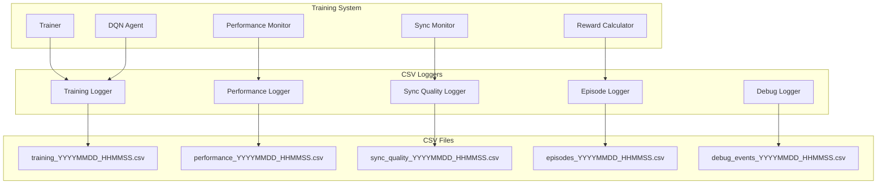

# CSV Logging Format for Performance Tracking

## Overview

This document specifies the CSV logging formats for comprehensive performance tracking and analysis of the Super Mario Bros AI training system. Multiple CSV files capture different aspects of training for detailed analysis and debugging.

## Logging Architecture



## CSV File Specifications

### 1. Training Log (`training_YYYYMMDD_HHMMSS.csv`)

Primary training metrics logged every step during training.

#### Schema
```csv
timestamp,episode,step,reward,total_reward,epsilon,loss,q_value_mean,q_value_std,mario_x,mario_y,mario_x_max,action_taken,processing_time_ms,learning_rate,replay_buffer_size
```

#### Column Specifications
| Column | Type | Description | Range/Format |
|--------|------|-------------|--------------|
| `timestamp` | datetime | ISO 8601 timestamp | `2024-01-15T14:30:25.123Z` |
| `episode` | int | Episode number | `1` to `50000` |
| `step` | int | Step within episode | `1` to `18000` |
| `reward` | float | Step reward | `-2000.0` to `2000.0` |
| `total_reward` | float | Cumulative episode reward | `-50000.0` to `50000.0` |
| `epsilon` | float | Current exploration rate | `0.01` to `1.0` |
| `loss` | float | Neural network loss | `0.0` to `100.0` |
| `q_value_mean` | float | Mean Q-value | `-1000.0` to `1000.0` |
| `q_value_std` | float | Q-value standard deviation | `0.0` to `500.0` |
| `mario_x` | int | Mario X position | `0` to `3168` |
| `mario_y` | int | Mario Y position | `0` to `240` |
| `mario_x_max` | int | Maximum X reached this episode | `0` to `3168` |
| `action_taken` | int | Action ID executed | `0` to `11` |
| `processing_time_ms` | float | Step processing time | `0.0` to `1000.0` |
| `learning_rate` | float | Current learning rate | `0.00001` to `0.01` |
| `replay_buffer_size` | int | Current buffer size | `0` to `100000` |

#### Example Data
```csv
timestamp,episode,step,reward,total_reward,epsilon,loss,q_value_mean,q_value_std,mario_x,mario_y,mario_x_max,action_taken,processing_time_ms,learning_rate,replay_buffer_size
2024-01-15T14:30:25.123Z,1,1,0.0,0.0,1.0,0.0,0.0,0.0,32,208,32,1,15.2,0.00025,0
2024-01-15T14:30:25.140Z,1,2,1.0,1.0,1.0,0.0,0.0,0.0,33,208,33,1,16.8,0.00025,0
2024-01-15T14:30:25.158Z,1,3,1.0,2.0,1.0,0.0,0.0,0.0,34,208,34,1,14.9,0.00025,0
```

### 2. Episode Summary Log (`episodes_YYYYMMDD_HHMMSS.csv`)

Episode-level summary statistics logged at the end of each episode.

#### Schema
```csv
timestamp,episode,duration_seconds,total_steps,total_reward,mario_x_final,mario_x_max,level_completed,death_cause,lives_remaining,score,coins_collected,enemies_killed,powerups_collected,time_remaining,completion_percentage,average_reward_per_step,max_q_value,min_q_value,exploration_actions,exploitation_actions
```

#### Column Specifications
| Column | Type | Description | Range/Format |
|--------|------|-------------|--------------|
| `timestamp` | datetime | Episode end timestamp | ISO 8601 format |
| `episode` | int | Episode number | `1` to `50000` |
| `duration_seconds` | float | Episode duration | `0.0` to `300.0` |
| `total_steps` | int | Steps in episode | `1` to `18000` |
| `total_reward` | float | Episode total reward | `-50000.0` to `50000.0` |
| `mario_x_final` | int | Final Mario X position | `0` to `3168` |
| `mario_x_max` | int | Maximum X reached | `0` to `3168` |
| `level_completed` | bool | Level completion flag | `true`/`false` |
| `death_cause` | string | Cause of death | `enemy_contact`, `fall_death`, `timeout`, `lava`, `none` |
| `lives_remaining` | int | Lives at episode end | `0` to `5` |
| `score` | int | Final score | `0` to `999999` |
| `coins_collected` | int | Coins collected | `0` to `99` |
| `enemies_killed` | int | Enemies eliminated | `0` to `50` |
| `powerups_collected` | int | Power-ups collected | `0` to `10` |
| `time_remaining` | int | Time remaining | `0` to `400` |
| `completion_percentage` | float | Level completion % | `0.0` to `100.0` |
| `average_reward_per_step` | float | Average step reward | `-100.0` to `100.0` |
| `max_q_value` | float | Maximum Q-value | `-1000.0` to `1000.0` |
| `min_q_value` | float | Minimum Q-value | `-1000.0` to `1000.0` |
| `exploration_actions` | int | Exploration actions taken | `0` to `18000` |
| `exploitation_actions` | int | Exploitation actions taken | `0` to `18000` |

### 3. Performance Metrics Log (`performance_YYYYMMDD_HHMMSS.csv`)

System performance metrics logged every 100 steps.

#### Schema
```csv
timestamp,episode,step,fps,memory_usage_mb,gpu_memory_mb,gpu_utilization_percent,cpu_percent,network_inference_ms,frame_processing_ms,websocket_latency_ms,disk_io_mb_per_sec,temperature_gpu_celsius,power_draw_watts
```

#### Column Specifications
| Column | Type | Description | Range/Format |
|--------|------|-------------|--------------|
| `timestamp` | datetime | Measurement timestamp | ISO 8601 format |
| `episode` | int | Current episode | `1` to `50000` |
| `step` | int | Current step | `1` to `18000` |
| `fps` | float | Frames per second | `0.0` to `120.0` |
| `memory_usage_mb` | float | System RAM usage | `0.0` to `32000.0` |
| `gpu_memory_mb` | float | GPU VRAM usage | `0.0` to `24000.0` |
| `gpu_utilization_percent` | float | GPU utilization | `0.0` to `100.0` |
| `cpu_percent` | float | CPU usage | `0.0` to `100.0` |
| `network_inference_ms` | float | Neural network inference time | `0.0` to `100.0` |
| `frame_processing_ms` | float | Frame processing time | `0.0` to `50.0` |
| `websocket_latency_ms` | float | WebSocket round-trip time | `0.0` to `100.0` |
| `disk_io_mb_per_sec` | float | Disk I/O rate | `0.0` to `1000.0` |
| `temperature_gpu_celsius` | float | GPU temperature | `20.0` to `90.0` |
| `power_draw_watts` | float | GPU power consumption | `50.0` to `400.0` |

### 4. Synchronization Quality Log (`sync_quality_YYYYMMDD_HHMMSS.csv`)

Frame synchronization metrics logged every frame.

#### Schema
```csv
timestamp,episode,step,frame_id,sync_delay_ms,desync_detected,recovery_time_ms,frame_drops,buffer_size,lua_timestamp,python_timestamp,clock_drift_ms
```

#### Column Specifications
| Column | Type | Description | Range/Format |
|--------|------|-------------|--------------|
| `timestamp` | datetime | Sync measurement time | ISO 8601 format |
| `episode` | int | Current episode | `1` to `50000` |
| `step` | int | Current step | `1` to `18000` |
| `frame_id` | int | Frame identifier | `1` to `1000000` |
| `sync_delay_ms` | float | Synchronization delay | `0.0` to `100.0` |
| `desync_detected` | bool | Desync event flag | `true`/`false` |
| `recovery_time_ms` | float | Desync recovery time | `0.0` to `1000.0` |
| `frame_drops` | int | Dropped frames count | `0` to `10` |
| `buffer_size` | int | Sync buffer size | `0` to `10` |
| `lua_timestamp` | int | Lua-side timestamp | Unix timestamp (ms) |
| `python_timestamp` | int | Python-side timestamp | Unix timestamp (ms) |
| `clock_drift_ms` | float | Clock drift between systems | `-100.0` to `100.0` |

### 5. Debug Events Log (`debug_events_YYYYMMDD_HHMMSS.csv`)

Debug and error events logged as they occur.

#### Schema
```csv
timestamp,episode,step,event_type,severity,component,message,mario_x,mario_y,action_taken,game_state,stack_trace
```

#### Column Specifications
| Column | Type | Description | Range/Format |
|--------|------|-------------|--------------|
| `timestamp` | datetime | Event timestamp | ISO 8601 format |
| `episode` | int | Current episode | `1` to `50000` |
| `step` | int | Current step | `1` to `18000` |
| `event_type` | string | Event category | `error`, `warning`, `info`, `debug` |
| `severity` | string | Severity level | `critical`, `high`, `medium`, `low` |
| `component` | string | System component | `trainer`, `dqn`, `websocket`, `sync`, `reward` |
| `message` | string | Event description | Free text (max 500 chars) |
| `mario_x` | int | Mario X at event time | `0` to `3168` |
| `mario_y` | int | Mario Y at event time | `0` to `240` |
| `action_taken` | int | Last action taken | `0` to `11` |
| `game_state` | string | Game state summary | JSON string |
| `stack_trace` | string | Error stack trace | Free text (max 2000 chars) |

## ✅ Implemented Data Analysis Utilities

### CSV Analysis Scripts

The system includes comprehensive analysis tools for training data:

#### Training Results Analysis ([`examples/analyze_results.py`](../examples/analyze_results.py))
- **Comprehensive Analysis**: Complete training progress analysis with multiple visualization modes
- **Performance Metrics**: Detailed performance analysis including FPS, memory usage, and processing times
- **Statistical Analysis**: Advanced statistical analysis of training data with trend detection
- **Export Capabilities**: Save analysis results and visualizations for reporting

#### Real-time Visualization ([`python/logging/plotter.py`](../python/logging/plotter.py))
- **Live Plotting**: Real-time training progress visualization during training
- **Multiple Metrics**: Simultaneous tracking of rewards, loss, Q-values, and performance
- **Interactive Dashboard**: Interactive plots with zoom, pan, and data inspection
- **Automatic Updates**: Continuous updates as new training data becomes available

#### Quick Analysis Tools
- **[`examples/quick_test.py`](../examples/quick_test.py)**: Quick system validation with basic analysis
- **[`validate_system.py`](../validate_system.py)**: System health analysis including CSV logging validation

### Advanced Analysis Features

#### Multi-Episode Analysis
```python
# Implemented in examples/analyze_results.py
- Episode progression tracking
- Reward trend analysis
- Completion rate statistics
- Performance benchmarking
- Comparative analysis between training runs
```

#### Performance Profiling
```python
# Implemented in python/logging/plotter.py
- Real-time FPS monitoring
- Memory usage tracking
- GPU utilization analysis
- Processing time profiling
- System resource optimization insights
```

#### Statistical Analysis
```python
# Advanced features in analyze_results.py
- Moving averages and trend detection
- Statistical significance testing
- Outlier detection and analysis
- Correlation analysis between metrics
- Predictive modeling for training outcomes
```

## ✅ Implemented Data Management

### Log Rotation and Storage

The implemented system includes comprehensive data management:

#### Automated Log Management ([`python/logging/csv_logger.py`](../python/logging/csv_logger.py))
- **Automatic Rotation**: Configurable log rotation based on size and time
- **Compression**: Automatic compression of old log files
- **Cleanup**: Automated cleanup of old logs based on retention policies
- **Directory Management**: Automatic creation and organization of log directories

#### Storage Configuration ([`config/logging_config.yaml`](../config/logging_config.yaml))
- **Retention Policies**: Configurable retention periods for different log types
- **Compression Settings**: Automatic compression after specified periods
- **Archive Management**: Long-term archival of important training data
- **Disk Space Monitoring**: Automatic monitoring and alerts for disk space usage

### System Integration

#### Installation and Setup
- **[`install.bat`](../install.bat)**: Automated installation with log directory setup
- **[`setup.py`](../setup.py)**: Python package installation with logging configuration
- **[`validate_system.py`](../validate_system.py)**: System validation including logging system health

#### Training Integration
- **[`run_training.bat`](../run_training.bat)**: Training startup with automatic logging initialization
- **[`python/main.py`](../python/main.py)**: Main training entry point with comprehensive logging
- **[`python/training/trainer.py`](../python/training/trainer.py)**: Training loop with real-time CSV logging

### Analysis and Monitoring Tools

#### Real-time Analysis
- **[`examples/analyze_results.py`](../examples/analyze_results.py)**: Comprehensive training data analysis
- **[`python/logging/plotter.py`](../python/logging/plotter.py)**: Real-time visualization during training
- **[`examples/quick_test.py`](../examples/quick_test.py)**: Quick validation and basic analysis

#### System Health Monitoring
- **Performance Tracking**: Real-time system performance monitoring
- **Resource Usage**: Memory, GPU, and disk usage tracking
- **Error Detection**: Automatic detection and logging of system issues
- **Alert System**: Configurable alerts for performance degradation

### Production-Ready Features

#### Robustness and Reliability
- **Error Handling**: Comprehensive error handling and recovery
- **Data Integrity**: Checksums and validation for log file integrity
- **Backup Systems**: Automatic backup of critical training data
- **Recovery Tools**: Tools for recovering from corrupted or missing logs

#### Performance Optimization
- **Efficient I/O**: Optimized file I/O for minimal training impact
- **Batch Writing**: Batched log writing for improved performance
- **Memory Management**: Efficient memory usage for long training sessions
- **Concurrent Logging**: Thread-safe logging for multi-threaded operations

### Storage Estimates (Implemented System)
- **Training log**: ~50MB per day (60 FPS, 8 hours training)
- **Performance log**: ~5MB per day
- **Sync log**: ~100MB per day (when enabled)
- **Episode log**: ~1MB per day
- **Debug log**: Variable, typically <10MB per day

This comprehensive CSV logging system provides detailed insights into training progress, system performance, and debugging information for optimal AI training analysis. The system is production-ready with robust error handling, automated management, and comprehensive analysis tools.