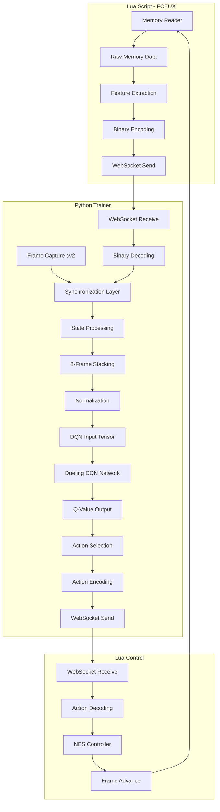

# Data Flow Design: Memory to Neural Network Actions

## Overview

This document details the complete data flow pipeline from NES memory extraction to neural network decision making and action execution.

## Data Flow Pipeline



## Stage 1: Memory Extraction (Lua Side)

### Raw Memory Reading
```lua
-- Memory addresses read every frame
local mario_data = {
    x_pos = memory.read_u16_le(0x0086, 0x03AD),  -- Combined world X position
    y_pos = memory.readbyte(0x03B8),             -- World Y position
    x_vel = memory.readbytesigned(0x0057),       -- X velocity
    y_vel = memory.readbytesigned(0x009F),       -- Y velocity
    power_state = memory.readbyte(0x0756),       -- Power level
    on_ground = memory.readbyte(0x001D),         -- Ground contact
    direction = memory.readbyte(0x0045),         -- Facing direction
    lives = memory.readbyte(0x075A),             -- Lives remaining
    invincible = memory.readbyte(0x079E)         -- Invincibility timer
}
```

### Feature Engineering
```lua
-- Derived features calculated in Lua
local features = {
    -- Normalized position (0.0 to 1.0)
    x_progress = mario_data.x_pos / 3168.0,
    
    -- Velocity magnitude and direction
    velocity_magnitude = math.sqrt(mario_data.x_vel^2 + mario_data.y_vel^2),
    velocity_angle = math.atan2(mario_data.y_vel, mario_data.x_vel),
    
    -- Relative enemy positions (screen coordinates)
    nearest_enemy_distance = calculate_nearest_enemy(),
    enemy_threat_level = calculate_threat_level(),
    
    -- Level progress indicators
    distance_to_flag = 3168 - mario_data.x_pos,
    level_completion_ratio = mario_data.x_pos / 3168.0
}
```

### Binary Data Packing
```lua
-- Pack data into efficient binary format
local binary_data = string.pack(
    "<I2I2i1i1BBBBBBBB",  -- Format string for little-endian
    mario_data.x_pos,      -- 2 bytes: X position
    mario_data.y_pos,      -- 2 bytes: Y position  
    mario_data.x_vel,      -- 1 byte: X velocity (signed)
    mario_data.y_vel,      -- 1 byte: Y velocity (signed)
    mario_data.power_state,-- 1 byte: Power state
    mario_data.on_ground,  -- 1 byte: Ground flag
    mario_data.direction,  -- 1 byte: Direction
    mario_data.lives,      -- 1 byte: Lives
    mario_data.invincible, -- 1 byte: Invincibility
    -- Additional enemy and level data...
)
```

## Stage 2: Data Reception and Synchronization (Python Side)

### WebSocket Data Reception
```python
async def receive_game_state(websocket):
    # Receive binary message
    binary_data = await websocket.recv()
    
    # Unpack binary data
    game_state = struct.unpack('<HHbbBBBBB', binary_data[:9])
    
    # Create structured game state
    state = {
        'mario_x': game_state[0],
        'mario_y': game_state[1], 
        'mario_x_vel': game_state[2],
        'mario_y_vel': game_state[3],
        'power_state': game_state[4],
        'on_ground': game_state[5],
        'direction': game_state[6],
        'lives': game_state[7],
        'invincible': game_state[8],
        'timestamp': time.time()
    }
    
    return state
```

### Frame Capture and Synchronization
```python
class FrameSynchronizer:
    def __init__(self):
        self.state_buffer = deque(maxlen=10)
        self.frame_buffer = deque(maxlen=10)
        
    def synchronize_frame_with_state(self, game_state, captured_frame):
        # Add timestamped data to buffers
        self.state_buffer.append({
            'state': game_state,
            'timestamp': game_state['timestamp']
        })
        
        self.frame_buffer.append({
            'frame': captured_frame,
            'timestamp': time.time()
        })
        
        # Find best matching frame for current state
        return self._match_frame_to_state()
        
    def _match_frame_to_state(self):
        if not self.state_buffer or not self.frame_buffer:
            return None
            
        latest_state = self.state_buffer[-1]
        
        # Find frame with closest timestamp
        best_frame = min(self.frame_buffer, 
                        key=lambda f: abs(f['timestamp'] - latest_state['timestamp']))
        
        return {
            'state': latest_state['state'],
            'frame': best_frame['frame'],
            'sync_quality': abs(best_frame['timestamp'] - latest_state['timestamp'])
        }
```

## Stage 3: State Processing and Feature Engineering

### State Vector Creation
```python
def create_state_vector(game_state, frame):
    # Normalize game state values
    normalized_state = {
        'mario_x_norm': game_state['mario_x'] / 3168.0,  # Level progress
        'mario_y_norm': game_state['mario_y'] / 240.0,   # Screen height
        'mario_x_vel_norm': game_state['mario_x_vel'] / 127.0,  # Max velocity
        'mario_y_vel_norm': game_state['mario_y_vel'] / 127.0,
        'power_state_onehot': np.eye(3)[game_state['power_state']],  # One-hot encoding
        'on_ground': float(game_state['on_ground']),
        'direction': float(game_state['direction'] - 1),  # Convert to 0/1
        'lives_norm': game_state['lives'] / 5.0,  # Assume max 5 lives
        'invincible': float(game_state['invincible'] > 0)
    }
    
    # Create feature vector
    feature_vector = np.concatenate([
        [normalized_state['mario_x_norm']],
        [normalized_state['mario_y_norm']],
        [normalized_state['mario_x_vel_norm']],
        [normalized_state['mario_y_vel_norm']],
        normalized_state['power_state_onehot'],
        [normalized_state['on_ground']],
        [normalized_state['direction']],
        [normalized_state['lives_norm']],
        [normalized_state['invincible']]
    ])
    
    return feature_vector
```

### Frame Preprocessing
```python
def preprocess_frame(frame):
    # Convert to grayscale
    gray_frame = cv2.cvtColor(frame, cv2.COLOR_BGR2GRAY)
    
    # Resize to standard input size
    resized_frame = cv2.resize(gray_frame, (84, 84))
    
    # Normalize pixel values
    normalized_frame = resized_frame.astype(np.float32) / 255.0
    
    return normalized_frame
```

## Stage 4: 8-Frame Stacking

### Frame Stack Management
```python
class FrameStack:
    def __init__(self, stack_size=8):
        self.stack_size = stack_size
        self.frames = deque(maxlen=stack_size)
        self.states = deque(maxlen=stack_size)
        
    def add_frame(self, frame, state_vector):
        processed_frame = preprocess_frame(frame)
        self.frames.append(processed_frame)
        self.states.append(state_vector)
        
        # Pad with zeros if not enough frames
        while len(self.frames) < self.stack_size:
            self.frames.appendleft(np.zeros_like(processed_frame))
            self.states.appendleft(np.zeros_like(state_vector))
            
    def get_stacked_input(self):
        # Stack frames along channel dimension
        frame_stack = np.stack(list(self.frames), axis=0)  # Shape: (8, 84, 84)
        
        # Use most recent state vector
        state_vector = self.states[-1] if self.states else np.zeros(12)
        
        return frame_stack, state_vector
```

## Stage 5: Neural Network Processing

### Input Tensor Creation
```python
def create_network_input(frame_stack, state_vector):
    # Convert to PyTorch tensors
    frame_tensor = torch.FloatTensor(frame_stack).unsqueeze(0)  # Add batch dimension
    state_tensor = torch.FloatTensor(state_vector).unsqueeze(0)
    
    # Move to GPU if available
    if torch.cuda.is_available():
        frame_tensor = frame_tensor.cuda()
        state_tensor = state_tensor.cuda()
        
    return frame_tensor, state_tensor
```

### Dueling DQN Forward Pass
```python
def forward_pass(model, frame_tensor, state_tensor):
    with torch.no_grad():
        # Get Q-values from Dueling DQN
        q_values = model(frame_tensor, state_tensor)
        
        # Apply softmax for action probabilities (optional)
        action_probs = torch.softmax(q_values, dim=1)
        
    return q_values.cpu().numpy(), action_probs.cpu().numpy()
```

## Stage 6: Action Selection and Execution

### Action Selection Strategy
```python
def select_action(q_values, epsilon=0.1, training=True):
    if training and np.random.random() < epsilon:
        # Epsilon-greedy exploration
        action = np.random.randint(0, len(q_values[0]))
    else:
        # Greedy action selection
        action = np.argmax(q_values[0])
        
    return action
```

### Action Mapping
```python
# NES controller action mapping (no select/start buttons)
ACTION_MAPPING = {
    0: {'right': False, 'left': False, 'A': False, 'B': False, 'up': False, 'down': False},  # No action
    1: {'right': True, 'left': False, 'A': False, 'B': False, 'up': False, 'down': False},   # Right
    2: {'right': False, 'left': True, 'A': False, 'B': False, 'up': False, 'down': False},   # Left
    3: {'right': False, 'left': False, 'A': True, 'B': False, 'up': False, 'down': False},   # Jump
    4: {'right': True, 'left': False, 'A': True, 'B': False, 'up': False, 'down': False},    # Right + Jump
    5: {'right': False, 'left': True, 'A': True, 'B': False, 'up': False, 'down': False},    # Left + Jump
    6: {'right': False, 'left': False, 'A': False, 'B': True, 'up': False, 'down': False},   # Run/Fire
    7: {'right': True, 'left': False, 'A': False, 'B': True, 'up': False, 'down': False},    # Right + Run
    8: {'right': False, 'left': True, 'A': False, 'B': True, 'up': False, 'down': False},    # Left + Run
    9: {'right': True, 'left': False, 'A': True, 'B': True, 'up': False, 'down': False},     # Right + Jump + Run (forward jumping)
    10: {'right': False, 'left': True, 'A': True, 'B': True, 'up': False, 'down': False},    # Left + Jump + Run
    11: {'right': False, 'left': False, 'A': False, 'B': False, 'up': False, 'down': True},  # Crouch/Down
}

def action_to_controller_input(action_id):
    return ACTION_MAPPING.get(action_id, ACTION_MAPPING[0])
```

### Action Transmission
```python
async def send_action(websocket, action_id, frame_id):
    controller_input = action_to_controller_input(action_id)
    
    action_message = {
        'type': 'action',
        'frame_id': frame_id,
        'buttons': controller_input,
        'hold_frames': 1
    }
    
    await websocket.send(json.dumps(action_message))
```

## Performance Optimizations

### Data Pipeline Efficiency
- **Asynchronous Processing**: WebSocket communication runs in separate thread
- **GPU Acceleration**: Neural network inference on CUDA-enabled GPU
- **Memory Management**: Circular buffers prevent memory leaks
- **Binary Protocol**: Reduces network overhead by ~60% vs JSON

### Latency Minimization
- **Frame Prediction**: Predict next frame while current frame processes
- **Batch Processing**: Process multiple frames simultaneously when possible
- **Model Optimization**: Use TensorRT or ONNX for faster inference

### Synchronization Quality Metrics
```python
def calculate_sync_metrics(sync_data):
    return {
        'avg_sync_delay': np.mean([d['sync_quality'] for d in sync_data]),
        'max_sync_delay': np.max([d['sync_quality'] for d in sync_data]),
        'sync_success_rate': len([d for d in sync_data if d['sync_quality'] < 0.016]) / len(sync_data)
    }
```

This data flow design ensures efficient, synchronized processing from NES memory to neural network actions with minimal latency and maximum accuracy.