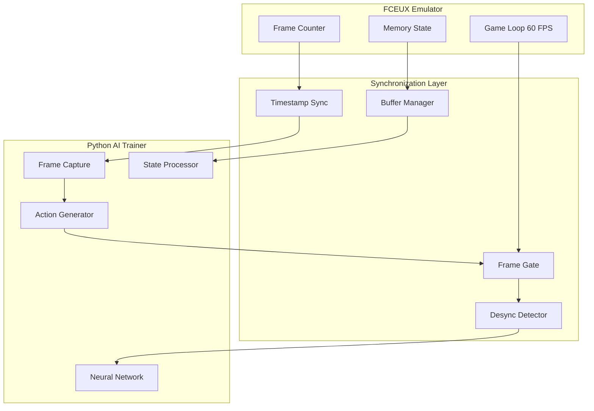

# Frame Synchronization Strategy

## Overview

Frame synchronization is critical to prevent desyncs between the FCEUX emulator and the Python AI trainer. This document outlines a multi-layered approach to ensure perfect alignment between game state, screen capture, and neural network actions.

## Synchronization Challenges

### Primary Issues
1. **Network Latency**: WebSocket communication introduces variable delays
2. **Processing Time**: Neural network inference takes variable time
3. **Frame Capture Timing**: cv2 screen capture may not align with game frames
4. **Buffer Overruns**: Fast emulator vs slower AI processing
5. **Clock Drift**: System clocks may drift over long training sessions

## Multi-Layer Synchronization Architecture



## Layer 1: Frame-Level Synchronization

### Controlled Frame Advancement
```lua
-- Lua script controls frame progression
local frame_id = 0
local waiting_for_action = false

function advance_frame()
    if not waiting_for_action then
        -- Send current game state
        local game_state = extract_game_state()
        game_state.frame_id = frame_id
        game_state.timestamp = get_timestamp_ms()
        
        send_binary_state(game_state)
        waiting_for_action = true
        
        -- Pause emulator until action received
        emu.pause()
    end
end

function receive_action(action_data)
    if action_data.frame_id == frame_id then
        -- Execute action
        execute_controller_input(action_data.buttons)
        
        -- Advance one frame
        emu.frameadvance()
        frame_id = frame_id + 1
        waiting_for_action = false
        
        -- Resume normal operation
        emu.unpause()
    else
        -- Frame ID mismatch - handle desync
        handle_frame_desync(action_data.frame_id, frame_id)
    end
end
```

### Python Frame Acknowledgment
```python
class FrameController:
    def __init__(self):
        self.current_frame_id = 0
        self.processing_frame_id = None
        self.frame_timeout = 100  # ms
        
    async def process_frame(self, game_state):
        # Validate frame sequence
        if game_state['frame_id'] != self.current_frame_id:
            await self.handle_frame_skip(game_state['frame_id'])
            
        self.processing_frame_id = game_state['frame_id']
        
        # Capture screen frame
        screen_frame = await self.capture_screen()
        
        # Synchronize with game state
        synced_data = await self.synchronize_frame_state(
            game_state, screen_frame
        )
        
        # Process through neural network
        action = await self.get_neural_action(synced_data)
        
        # Send action with frame ID
        await self.send_action(action, self.processing_frame_id)
        
        self.current_frame_id += 1
```

## Layer 2: Timestamp Synchronization

### High-Resolution Timing
```lua
-- Lua timestamp generation (milliseconds)
function get_timestamp_ms()
    return math.floor(os.clock() * 1000)
end

-- Enhanced state with timing
function extract_game_state()
    local state = {
        -- Game data...
        frame_id = frame_id,
        timestamp = get_timestamp_ms(),
        frame_duration = calculate_frame_duration()
    }
    return state
end
```

```python
import time
import asyncio

class TimestampSynchronizer:
    def __init__(self):
        self.clock_offset = 0
        self.last_sync_time = 0
        self.sync_interval = 1000  # Sync every 1000 frames
        
    def get_synchronized_timestamp(self):
        return int((time.time() * 1000) + self.clock_offset)
        
    async def sync_clocks(self, lua_timestamp):
        """Synchronize Python and Lua clocks"""
        python_timestamp = int(time.time() * 1000)
        self.clock_offset = lua_timestamp - python_timestamp
        
        # Log clock drift
        if abs(self.clock_offset) > 50:  # >50ms drift
            logger.warning(f"Clock drift detected: {self.clock_offset}ms")
```

## Layer 3: Buffer Management

### Circular Buffer System
```python
from collections import deque
import threading

class SynchronizedBuffer:
    def __init__(self, max_size=10):
        self.game_states = deque(maxlen=max_size)
        self.screen_frames = deque(maxlen=max_size)
        self.lock = threading.Lock()
        
    def add_game_state(self, state):
        with self.lock:
            self.game_states.append({
                'state': state,
                'timestamp': state['timestamp'],
                'frame_id': state['frame_id']
            })
            
    def add_screen_frame(self, frame):
        with self.lock:
            self.screen_frames.append({
                'frame': frame,
                'timestamp': int(time.time() * 1000),
                'capture_id': len(self.screen_frames)
            })
            
    def get_synchronized_pair(self, target_frame_id):
        with self.lock:
            # Find game state with matching frame ID
            target_state = None
            for state_data in reversed(self.game_states):
                if state_data['frame_id'] == target_frame_id:
                    target_state = state_data
                    break
                    
            if not target_state:
                return None
                
            # Find closest screen frame by timestamp
            best_frame = min(
                self.screen_frames,
                key=lambda f: abs(f['timestamp'] - target_state['timestamp'])
            )
            
            sync_quality = abs(best_frame['timestamp'] - target_state['timestamp'])
            
            return {
                'game_state': target_state['state'],
                'screen_frame': best_frame['frame'],
                'sync_quality': sync_quality,
                'frame_id': target_frame_id
            }
```

## Layer 4: Desync Detection and Recovery

### Desync Detection
```python
class DesyncDetector:
    def __init__(self):
        self.expected_frame_id = 0
        self.frame_skip_threshold = 2
        self.timeout_threshold = 200  # ms
        self.desync_count = 0
        
    def check_frame_sequence(self, received_frame_id):
        if received_frame_id != self.expected_frame_id:
            gap = received_frame_id - self.expected_frame_id
            
            if gap > self.frame_skip_threshold:
                return DesyncType.FRAME_SKIP
            elif gap < 0:
                return DesyncType.FRAME_REWIND
            else:
                return DesyncType.MINOR_SKIP
                
        return DesyncType.SYNCHRONIZED
        
    def check_timing(self, state_timestamp, current_time):
        delay = current_time - state_timestamp
        
        if delay > self.timeout_threshold:
            return DesyncType.TIMEOUT
            
        return DesyncType.SYNCHRONIZED

class DesyncType:
    SYNCHRONIZED = "synchronized"
    FRAME_SKIP = "frame_skip"
    FRAME_REWIND = "frame_rewind"
    MINOR_SKIP = "minor_skip"
    TIMEOUT = "timeout"
```

### Recovery Strategies
```python
class DesyncRecovery:
    async def handle_desync(self, desync_type, context):
        if desync_type == DesyncType.FRAME_SKIP:
            await self.recover_from_frame_skip(context)
        elif desync_type == DesyncType.TIMEOUT:
            await self.recover_from_timeout(context)
        elif desync_type == DesyncType.FRAME_REWIND:
            await self.recover_from_rewind(context)
            
    async def recover_from_frame_skip(self, context):
        """Handle when frames are skipped"""
        # Request current frame state from Lua
        await self.request_frame_resync()
        
        # Clear buffers to prevent stale data
        self.buffer.clear()
        
        # Reset frame counter
        self.frame_controller.resync_frame_id(context['received_frame_id'])
        
    async def recover_from_timeout(self, context):
        """Handle communication timeouts"""
        # Send heartbeat to check connection
        if await self.send_heartbeat():
            # Connection OK, just slow processing
            await self.request_frame_hold()
        else:
            # Connection lost, attempt reconnection
            await self.reconnect_websocket()
            
    async def request_frame_resync(self):
        """Request Lua to send current frame state"""
        resync_message = {
            'type': 'resync_request',
            'timestamp': int(time.time() * 1000)
        }
        await self.websocket.send(json.dumps(resync_message))
```

## Layer 5: Performance Monitoring

### Synchronization Metrics
```python
class SyncMetrics:
    def __init__(self):
        self.frame_delays = deque(maxlen=1000)
        self.sync_qualities = deque(maxlen=1000)
        self.desync_events = []
        
    def record_frame_processing(self, start_time, end_time, sync_quality):
        processing_time = end_time - start_time
        self.frame_delays.append(processing_time)
        self.sync_qualities.append(sync_quality)
        
    def get_performance_stats(self):
        if not self.frame_delays:
            return None
            
        return {
            'avg_frame_delay': sum(self.frame_delays) / len(self.frame_delays),
            'max_frame_delay': max(self.frame_delays),
            'avg_sync_quality': sum(self.sync_qualities) / len(self.sync_qualities),
            'desync_rate': len(self.desync_events) / len(self.frame_delays),
            'frames_processed': len(self.frame_delays)
        }
```

## Configuration Parameters

### Timing Configuration
```yaml
synchronization:
  frame_timeout_ms: 100
  max_frame_skip: 2
  sync_buffer_size: 10
  clock_sync_interval: 1000
  heartbeat_interval_ms: 1000
  
performance:
  target_fps: 60
  max_processing_delay_ms: 16
  sync_quality_threshold_ms: 5
  
recovery:
  max_desync_count: 5
  reconnect_attempts: 3
  reconnect_delay_ms: 1000
```

## Implementation Sequence

### Initialization
1. Establish WebSocket connection
2. Perform initial clock synchronization
3. Initialize buffers and counters
4. Start heartbeat monitoring

### Runtime Loop
1. Lua sends game state with frame ID and timestamp
2. Python captures screen frame with timestamp
3. Synchronization layer matches state to frame
4. Neural network processes synchronized data
5. Action sent back with frame ID
6. Lua validates frame ID and executes action
7. Metrics recorded and desync detection performed

### Error Handling
1. Detect desync condition
2. Determine recovery strategy
3. Execute recovery procedure
4. Resume normal operation
5. Log incident for analysis

This multi-layered approach ensures robust synchronization while providing graceful degradation and recovery mechanisms for various failure modes.