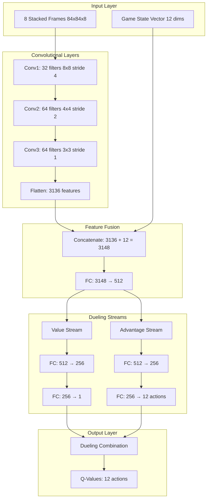

# Dueling DQN Architecture with 8-Frame Stacking

## Overview

This document specifies the neural network architecture for the Super Mario Bros AI trainer, featuring a Dueling DQN with 8-frame stacking for temporal understanding and improved action-value estimation.

## Architecture Philosophy

### Dueling DQN Benefits
- **Separate Value and Advantage Streams**: Better learning of state values vs action advantages
- **Improved Sample Efficiency**: More stable learning with fewer samples
- **Better Generalization**: Handles unseen states more effectively

### 8-Frame Stacking Benefits
- **Temporal Context**: Understanding of movement patterns and velocities
- **Occlusion Handling**: Seeing objects that temporarily disappear
- **Animation Understanding**: Recognizing enemy states and Mario's actions

## Network Architecture



## Detailed Layer Specifications

### Input Processing

#### Frame Stack Input
```python
# Input shape: (batch_size, 8, 84, 84)
# 8 consecutive grayscale frames stacked along channel dimension
frame_input_shape = (8, 84, 84)

# Frame preprocessing pipeline:
# 1. RGB to grayscale conversion
# 2. Resize to 84x84
# 3. Normalize to [0, 1]
# 4. Stack 8 consecutive frames
```

#### Game State Vector
```python
# Input shape: (batch_size, 12)
state_vector_features = [
    'mario_x_norm',          # Mario X position (normalized 0-1)
    'mario_y_norm',          # Mario Y position (normalized 0-1)
    'mario_x_vel_norm',      # Mario X velocity (normalized -1 to 1)
    'mario_y_vel_norm',      # Mario Y velocity (normalized -1 to 1)
    'power_state_small',     # One-hot: small Mario
    'power_state_big',       # One-hot: big Mario
    'power_state_fire',      # One-hot: fire Mario
    'on_ground',             # Boolean: on ground flag
    'direction',             # Boolean: facing direction
    'lives_norm',            # Lives remaining (normalized 0-1)
    'invincible',            # Boolean: invincibility active
    'level_progress'         # Level completion percentage (0-1)
]
```

### Convolutional Layers

#### Layer 1: Feature Detection
```python
conv1 = nn.Conv2d(
    in_channels=8,      # 8 stacked frames
    out_channels=32,    # 32 feature maps
    kernel_size=8,      # 8x8 kernels
    stride=4,           # Stride of 4
    padding=2           # Padding to maintain spatial relationships
)
# Output shape: (batch_size, 32, 21, 21)
# Activation: ReLU
```

#### Layer 2: Pattern Recognition
```python
conv2 = nn.Conv2d(
    in_channels=32,     # From conv1
    out_channels=64,    # 64 feature maps
    kernel_size=4,      # 4x4 kernels
    stride=2,           # Stride of 2
    padding=1           # Padding
)
# Output shape: (batch_size, 64, 11, 11)
# Activation: ReLU
```

#### Layer 3: Fine Detail Extraction
```python
conv3 = nn.Conv2d(
    in_channels=64,     # From conv2
    out_channels=64,    # 64 feature maps
    kernel_size=3,      # 3x3 kernels
    stride=1,           # Stride of 1
    padding=1           # Padding
)
# Output shape: (batch_size, 64, 11, 11)
# Activation: ReLU
```

### Feature Fusion Layer

#### Flattening and Concatenation
```python
# Flatten convolutional output
conv_features = conv3_output.view(batch_size, -1)  # Shape: (batch_size, 7744)

# Concatenate with game state vector
fused_features = torch.cat([conv_features, state_vector], dim=1)
# Shape: (batch_size, 7744 + 12 = 7756)

# Fusion fully connected layer
fusion_fc = nn.Linear(7756, 512)
# Output shape: (batch_size, 512)
# Activation: ReLU
# Dropout: 0.3 during training
```

### Dueling Architecture

#### Value Stream
```python
class ValueStream(nn.Module):
    def __init__(self):
        super().__init__()
        self.fc1 = nn.Linear(512, 256)
        self.fc2 = nn.Linear(256, 1)
        self.dropout = nn.Dropout(0.3)
        
    def forward(self, x):
        x = F.relu(self.fc1(x))
        x = self.dropout(x)
        value = self.fc2(x)  # Single value output
        return value
```

#### Advantage Stream
```python
class AdvantageStream(nn.Module):
    def __init__(self, num_actions=12):
        super().__init__()
        self.fc1 = nn.Linear(512, 256)
        self.fc2 = nn.Linear(256, num_actions)
        self.dropout = nn.Dropout(0.3)
        
    def forward(self, x):
        x = F.relu(self.fc1(x))
        x = self.dropout(x)
        advantages = self.fc2(x)  # Advantage for each action
        return advantages
```

#### Dueling Combination
```python
def combine_dueling_outputs(value, advantages):
    # Subtract mean advantage to ensure identifiability
    advantages_mean = advantages.mean(dim=1, keepdim=True)
    advantages_centered = advantages - advantages_mean
    
    # Combine value and advantages
    q_values = value + advantages_centered
    
    return q_values
```

## Complete Network Implementation

```python
import torch
import torch.nn as nn
import torch.nn.functional as F

class DuelingDQN(nn.Module):
    def __init__(self, num_actions=12, state_vector_size=12):
        super(DuelingDQN, self).__init__()
        
        # Convolutional layers for frame processing
        self.conv1 = nn.Conv2d(8, 32, kernel_size=8, stride=4, padding=2)
        self.conv2 = nn.Conv2d(32, 64, kernel_size=4, stride=2, padding=1)
        self.conv3 = nn.Conv2d(64, 64, kernel_size=3, stride=1, padding=1)
        
        # Calculate conv output size
        self.conv_output_size = self._get_conv_output_size()
        
        # Feature fusion layer
        self.fusion_fc = nn.Linear(
            self.conv_output_size + state_vector_size, 512
        )
        
        # Value stream
        self.value_fc1 = nn.Linear(512, 256)
        self.value_fc2 = nn.Linear(256, 1)
        
        # Advantage stream
        self.advantage_fc1 = nn.Linear(512, 256)
        self.advantage_fc2 = nn.Linear(256, num_actions)
        
        # Dropout for regularization
        self.dropout = nn.Dropout(0.3)
        
        # Initialize weights
        self._initialize_weights()
        
    def _get_conv_output_size(self):
        # Calculate output size after convolutions
        # Input: (8, 84, 84)
        # After conv1: (32, 21, 21)
        # After conv2: (64, 11, 11)  
        # After conv3: (64, 11, 11)
        return 64 * 11 * 11  # 7744
        
    def _initialize_weights(self):
        for module in self.modules():
            if isinstance(module, nn.Conv2d) or isinstance(module, nn.Linear):
                nn.init.kaiming_normal_(module.weight, nonlinearity='relu')
                if module.bias is not None:
                    nn.init.constant_(module.bias, 0)
                    
    def forward(self, frames, state_vector):
        # Process frame stack through convolutions
        x = F.relu(self.conv1(frames))
        x = F.relu(self.conv2(x))
        x = F.relu(self.conv3(x))
        
        # Flatten convolutional output
        conv_features = x.view(x.size(0), -1)
        
        # Fuse with state vector
        fused = torch.cat([conv_features, state_vector], dim=1)
        fused = F.relu(self.fusion_fc(fused))
        fused = self.dropout(fused)
        
        # Value stream
        value = F.relu(self.value_fc1(fused))
        value = self.dropout(value)
        value = self.value_fc2(value)
        
        # Advantage stream
        advantage = F.relu(self.advantage_fc1(fused))
        advantage = self.dropout(advantage)
        advantage = self.advantage_fc2(advantage)
        
        # Combine using dueling architecture
        advantage_mean = advantage.mean(dim=1, keepdim=True)
        q_values = value + (advantage - advantage_mean)
        
        return q_values
```

## Training Configuration

### Network Parameters
```yaml
network:
  architecture: "dueling_dqn"
  frame_stack_size: 8
  frame_size: [84, 84]
  state_vector_size: 12
  num_actions: 12
  
  conv_layers:
    - {filters: 32, kernel: 8, stride: 4, padding: 2}
    - {filters: 64, kernel: 4, stride: 2, padding: 1}
    - {filters: 64, kernel: 3, stride: 1, padding: 1}
    
  fusion_layer:
    hidden_size: 512
    dropout: 0.3
    
  dueling_streams:
    value_hidden: 256
    advantage_hidden: 256
    dropout: 0.3
```

### Training Hyperparameters
```yaml
training:
  learning_rate: 0.00025
  batch_size: 32
  replay_buffer_size: 100000
  target_update_frequency: 1000
  epsilon_start: 1.0
  epsilon_end: 0.01
  epsilon_decay: 0.995
  gamma: 0.99
  
  optimizer: "Adam"
  loss_function: "Huber"
  gradient_clipping: 10.0
```

## Memory and Performance Considerations

### GPU Memory Usage
```python
# Estimated memory usage per batch (batch_size=32):
# - Frame input: 32 * 8 * 84 * 84 * 4 bytes = ~7.2 MB
# - State vector: 32 * 12 * 4 bytes = ~1.5 KB
# - Network parameters: ~2.5 MB
# - Gradients: ~2.5 MB
# - Activations: ~10 MB
# Total: ~22 MB per batch
```

### Optimization Strategies
```python
# Mixed precision training
scaler = torch.cuda.amp.GradScaler()

# Gradient accumulation for larger effective batch size
accumulation_steps = 4

# Model compilation for faster inference
model = torch.compile(model, mode="reduce-overhead")
```

## Action Space Mapping

### Network Output to Actions
```python
# Network outputs 12 Q-values corresponding to:
ACTION_SPACE = {
    0: "no_action",
    1: "right",
    2: "left", 
    3: "jump",
    4: "right_jump",
    5: "left_jump",
    6: "run",
    7: "right_run",
    8: "left_run",
    9: "right_jump_run",  # Forward jumping
    10: "left_jump_run",
    11: "crouch"
}
```

This architecture provides a robust foundation for learning complex Mario behaviors while maintaining computational efficiency and training stability.