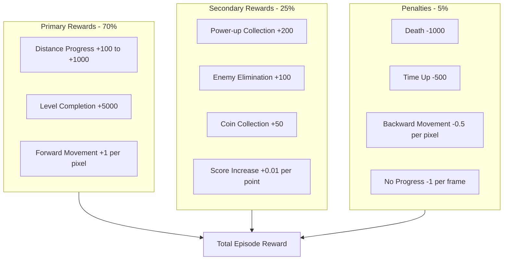

# Reward System Design

## Overview

The reward system is designed to train Mario to complete World 1-1 by prioritizing rightward movement (level progression) while incentivizing survival behaviors like collecting power-ups, avoiding enemies, and scoring points.

## Reward Philosophy

### Primary Objective: Level Progression
- **Maximum X distance** reached is the paramount goal
- Rightward movement is consistently rewarded
- Level completion provides the highest reward

### Secondary Objectives: Survival and Scoring
- Power-ups improve survivability and should be collected
- Enemy elimination provides points and removes threats
- Coin collection demonstrates exploration and skill
- Time management prevents timeout deaths

## Reward Components



## Detailed Reward Structure

### 1. Distance-Based Rewards (Primary - 60%)

#### Forward Progress Reward
```python
def calculate_distance_reward(current_x, previous_x, max_x_reached):
    # Immediate forward movement reward
    forward_movement = max(0, current_x - previous_x)
    movement_reward = forward_movement * 1.0
    
    # Milestone rewards for new maximum distance
    milestone_reward = 0
    if current_x > max_x_reached:
        new_distance = current_x - max_x_reached
        # Exponential reward for reaching new areas
        milestone_reward = new_distance * 10.0
        
        # Bonus for significant progress milestones
        progress_percentage = current_x / 3168.0  # World 1-1 length
        if progress_percentage >= 0.25:  # 25% completion
            milestone_reward += 100
        if progress_percentage >= 0.50:  # 50% completion
            milestone_reward += 200
        if progress_percentage >= 0.75:  # 75% completion
            milestone_reward += 300
        if progress_percentage >= 0.90:  # Near completion
            milestone_reward += 500
    
    return movement_reward + milestone_reward
```

#### Level Completion Reward
```python
def calculate_completion_reward(level_completed, time_remaining):
    if level_completed:
        base_completion = 5000
        # Time bonus for faster completion
        time_bonus = time_remaining * 2.0
        return base_completion + time_bonus
    return 0
```

### 2. Survival and Scoring Rewards (Secondary - 25%)

#### Power-up Collection
```python
def calculate_powerup_reward(previous_power, current_power):
    power_values = {0: 0, 1: 200, 2: 400}  # small, big, fire
    
    if current_power > previous_power:
        # Reward for gaining power
        return power_values[current_power] - power_values[previous_power]
    elif current_power < previous_power:
        # Penalty for losing power (but less than death)
        return -100
    return 0
```

#### Enemy Elimination
```python
def calculate_enemy_reward(enemies_killed, kill_method):
    base_reward = enemies_killed * 100
    
    # Bonus for different kill methods
    method_bonus = {
        'stomp': 1.0,      # Standard stomp
        'fireball': 1.2,   # Fireball kill
        'shell': 1.5,      # Shell kill
        'star': 0.8        # Star kill (less skill required)
    }
    
    return base_reward * method_bonus.get(kill_method, 1.0)
```

#### Coin and Score Rewards
```python
def calculate_score_reward(score_increase, coins_collected):
    # Small reward for score increase
    score_reward = score_increase * 0.01
    
    # Larger reward for coin collection
    coin_reward = coins_collected * 50
    
    # Bonus for coin milestones
    milestone_bonus = 0
    if coins_collected >= 10:
        milestone_bonus += 100  # 1-up threshold
    
    return score_reward + coin_reward + milestone_bonus
```

### 3. Penalty System (5%)

#### Death Penalties
```python
def calculate_death_penalty(death_cause, lives_remaining):
    base_penalty = -1000
    
    # Adjust penalty based on cause
    cause_multiplier = {
        'enemy_contact': 1.0,
        'fall_death': 1.2,     # Falling is worse
        'timeout': 0.8,        # Less harsh for timeout
        'lava': 1.5            # Lava death is worst
    }
    
    # Reduce penalty if many lives remaining (early in training)
    life_multiplier = max(0.5, 1.0 - (lives_remaining * 0.1))
    
    return base_penalty * cause_multiplier.get(death_cause, 1.0) * life_multiplier
```

#### Movement Penalties
```python
def calculate_movement_penalty(current_x, previous_x, frames_stuck):
    penalty = 0
    
    # Backward movement penalty
    if current_x < previous_x:
        backward_distance = previous_x - current_x
        penalty -= backward_distance * 0.5
    
    # Stuck penalty (no progress for multiple frames)
    if frames_stuck > 60:  # 1 second at 60 FPS
        penalty -= min(frames_stuck - 60, 120) * 1.0  # Cap at 2 seconds
    
    return penalty
```

## Reward Calculation Pipeline

### Frame-by-Frame Reward
```python
class RewardCalculator:
    def __init__(self):
        self.previous_state = None
        self.max_x_reached = 0
        self.frames_stuck = 0
        self.last_x_position = 0
        
    def calculate_frame_reward(self, current_state):
        if self.previous_state is None:
            self.previous_state = current_state
            return 0
            
        total_reward = 0
        
        # 1. Distance rewards (primary)
        distance_reward = self.calculate_distance_reward(
            current_state['mario_x'], 
            self.previous_state['mario_x']
        )
        total_reward += distance_reward
        
        # 2. Survival rewards (secondary)
        powerup_reward = self.calculate_powerup_reward(
            self.previous_state['power_state'],
            current_state['power_state']
        )
        total_reward += powerup_reward
        
        # 3. Score rewards
        score_increase = current_state['score'] - self.previous_state['score']
        coins_collected = current_state['coins'] - self.previous_state['coins']
        score_reward = self.calculate_score_reward(score_increase, coins_collected)
        total_reward += score_reward
        
        # 4. Movement penalties
        movement_penalty = self.calculate_movement_penalty(
            current_state['mario_x'],
            self.previous_state['mario_x']
        )
        total_reward += movement_penalty
        
        # Update tracking variables
        self.max_x_reached = max(self.max_x_reached, current_state['mario_x'])
        self.update_stuck_counter(current_state['mario_x'])
        self.previous_state = current_state
        
        return total_reward
```

### Episode-End Rewards
```python
def calculate_episode_reward(episode_data):
    total_reward = 0
    
    # Level completion bonus
    if episode_data['level_completed']:
        completion_reward = calculate_completion_reward(
            True, episode_data['time_remaining']
        )
        total_reward += completion_reward
    
    # Death penalty
    if episode_data['died']:
        death_penalty = calculate_death_penalty(
            episode_data['death_cause'],
            episode_data['lives_remaining']
        )
        total_reward += death_penalty
    
    # Distance achievement bonus
    final_distance = episode_data['max_x_reached']
    distance_bonus = final_distance * 0.5  # Bonus for total distance
    total_reward += distance_bonus
    
    return total_reward
```

## Reward Shaping Strategies

### 1. Curriculum Learning Integration
```python
class CurriculumRewardShaper:
    def __init__(self):
        self.training_phase = "exploration"  # exploration -> optimization -> mastery
        
    def shape_reward(self, base_reward, performance_metrics):
        if self.training_phase == "exploration":
            # Emphasize exploration and forward movement
            return base_reward * 1.2 if base_reward > 0 else base_reward * 0.8
            
        elif self.training_phase == "optimization":
            # Balance all objectives
            return base_reward
            
        elif self.training_phase == "mastery":
            # Emphasize completion and efficiency
            return self.apply_efficiency_bonus(base_reward, performance_metrics)
```

### 2. Adaptive Reward Scaling
```python
def adaptive_reward_scaling(reward, episode_number, performance_history):
    # Scale rewards based on learning progress
    if episode_number < 1000:
        # Early training: emphasize exploration
        exploration_bonus = 1.5 if reward > 0 else 1.0
        return reward * exploration_bonus
        
    elif episode_number < 5000:
        # Mid training: balanced approach
        return reward
        
    else:
        # Late training: emphasize consistency and completion
        recent_performance = np.mean(performance_history[-100:])
        if recent_performance > 0.8:  # High performance
            return reward * 0.9  # Reduce reward magnitude
        else:
            return reward * 1.1  # Increase reward for improvement
```

## Reward Configuration

### Configurable Parameters
```yaml
rewards:
  primary:
    forward_movement_multiplier: 1.0
    milestone_multiplier: 10.0
    completion_reward: 5000
    progress_bonuses: [100, 200, 300, 500]  # 25%, 50%, 75%, 90%
    
  secondary:
    powerup_rewards: [0, 200, 400]  # small, big, fire
    enemy_kill_reward: 100
    coin_reward: 50
    score_multiplier: 0.01
    
  penalties:
    death_penalty: -1000
    backward_movement_multiplier: -0.5
    stuck_penalty_per_frame: -1.0
    stuck_threshold_frames: 60
    
  shaping:
    curriculum_enabled: true
    adaptive_scaling: true
    reward_clipping: [-2000, 2000]
```

## Performance Metrics Integration

### Reward Effectiveness Tracking
```python
class RewardMetrics:
    def __init__(self):
        self.reward_components = {
            'distance': [],
            'survival': [],
            'score': [],
            'penalties': []
        }
        
    def track_reward_breakdown(self, reward_dict):
        for component, value in reward_dict.items():
            if component in self.reward_components:
                self.reward_components[component].append(value)
                
    def analyze_reward_effectiveness(self):
        return {
            'distance_contribution': np.mean(self.reward_components['distance']),
            'survival_contribution': np.mean(self.reward_components['survival']),
            'penalty_frequency': len([p for p in self.reward_components['penalties'] if p < 0]),
            'reward_variance': np.var(sum(self.reward_components.values(), []))
        }
```

This reward system design ensures that Mario learns to prioritize level completion while developing survival skills and game awareness through balanced incentives and penalties.