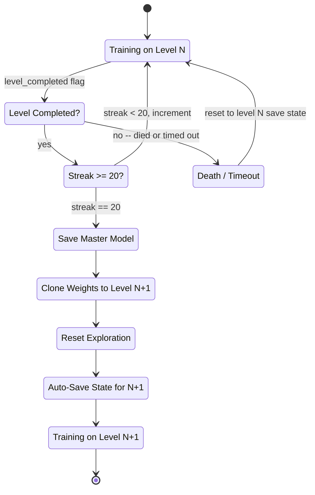
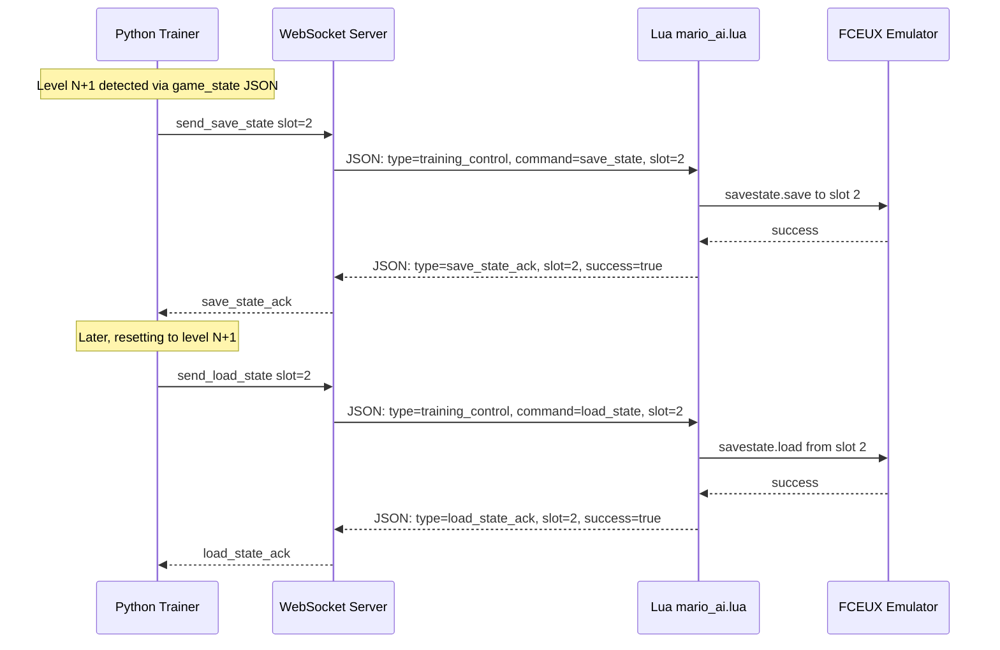
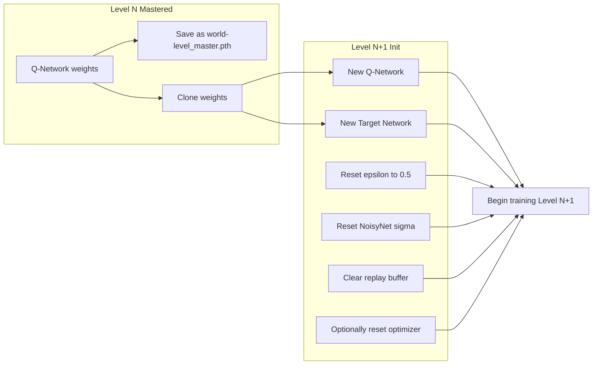
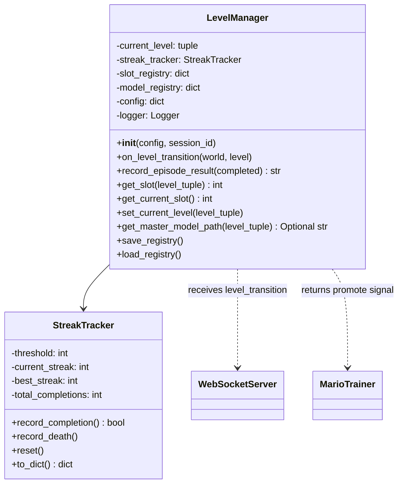

# Level Progression System -- Design Document

**Project:** Super Mario Bot V3  
**Date:** 2026-03-26  
**Status:** Planned  
**Depends on:** Training confirmed working (session `20260325_182117`)

---

## Overview

This document describes a complete level progression system that lets the bot
automatically advance from World 1-1 through subsequent levels. When the bot
masters a level (defined as 20 consecutive completions), it:

1. Freezes and saves the current model as a mastered checkpoint
2. Clones the model weights to initialize a new model for the next level
3. Resets exploration parameters so the agent re-explores the new layout
4. Begins training on the next level using an auto-saved FCEUX save state

The system touches four layers of the stack: FCEUX save states (Lua), WebSocket
protocol (Lua + Python), training orchestration (Python trainer), and model
management (Python agent).

---

## Architecture Diagrams

### Level Progression Flow



### Save State Bridge Protocol



### Model Transfer Pipeline



---

## 1. Save State Bridge

### Problem

The bot currently hard-codes save state slot 10 for World 1-1. To train on
multiple levels, we need the ability to save and load arbitrary FCEUX save state
slots from Python, and to map each discovered level to a dedicated slot.

### Lua Side: [`handle_training_control()`](lua/mario_ai.lua:2192)

Add two new command branches to the existing function:

```lua
elseif message.command == "save_state" then
    local slot = message.slot or 10
    local st = savestate.object(slot)
    local success = pcall(savestate.save, st)
    -- send ack back with success/failure

elseif message.command == "load_state" then
    local slot = message.slot or 10
    local st = savestate.object(slot)
    local success = pcall(savestate.load, st)
    -- send ack back, reset frame counters
```

Also update [`reset_game_to_level_1_1()`](lua/mario_ai.lua:2080) to accept a
slot parameter (rename to `reset_game_to_save_state(slot)`), defaulting to
slot 10 for backward compatibility.

### Python Side: [`WebSocketServer`](python/communication/websocket_server.py:41)

Add two convenience methods:

```python
async def send_save_state(self, slot: int) -> bool:
    """Send save_state command to FCEUX via Lua."""
    return await self.send_training_control(
        command="save_state", slot=slot
    )

async def send_load_state(self, slot: int) -> bool:
    """Send load_state command to FCEUX via Lua."""
    return await self.send_training_control(
        command="load_state", slot=slot
    )
```

Extend [`send_training_control()`](python/communication/websocket_server.py:712)
to accept `**kwargs` and merge them into the JSON payload, so `slot` passes
through transparently.

Register a new JSON handler for `save_state_ack` and `load_state_ack` message
types so the trainer can await confirmation.

### Save State Slot Mapping

| Slot | Level | Notes |
|------|-------|-------|
| 10 | 1-1 | Current default, backward compatible |
| 1 | 1-2 | Assigned on first detection |
| 2 | 1-3 | Assigned on first detection |
| 3 | 1-4 | Assigned on first detection |
| 4 | 2-1 | Assigned on first detection |
| ... | ... | Up to slot 9 for 9 discovered levels |

The slot registry lives in `LevelManager` (see section 5) and is persisted to
`checkpoints/level_registry.json`.

### Protocol Messages

**Save state request** (Python -> Lua):
```json
{
    "type": "training_control",
    "command": "save_state",
    "slot": 2,
    "episode_id": 1234
}
```

**Save state acknowledgment** (Lua -> Python):
```json
{
    "type": "save_state_ack",
    "slot": 2,
    "success": true,
    "world": 1,
    "level": 2,
    "timestamp": 1711411234567
}
```

**Load state request** (Python -> Lua):
```json
{
    "type": "training_control",
    "command": "load_state",
    "slot": 2,
    "episode_id": 1235
}
```

**Load state acknowledgment** (Lua -> Python):
```json
{
    "type": "load_state_ack",
    "slot": 2,
    "success": true,
    "timestamp": 1711411234890
}
```

---

## 2. Level Detection

### Problem

We need to reliably detect when Mario transitions to a new level so we can
auto-save the state and notify the trainer. False positives are dangerous --
saving a state mid-transition would create a broken checkpoint.

### Detection Strategy: Dual Confirmation

The most reliable signal is a **dual confirmation**: the level byte has changed
AND the timer transitions from 400 to 399. This proves:

1. The level memory address actually reflects a new stage (not a sub-area)
2. Gameplay is active (not in a transition animation or loading screen)
3. The timer has started counting down, meaning Mario has control

### Memory Addresses

| Address | Name | Purpose |
|---------|------|---------|
| `0x075F` | [`WORLD`](lua/mario_ai.lua:93) | Current world number (0-indexed) |
| `0x075C` | `LEVEL` | Current level/stage number (0-indexed) |
| `0x07F8` | [`LEVEL_TIME_HUNDREDS`](lua/mario_ai.lua:81) | Timer hundreds digit |

> **Note:** The existing codebase uses `0x0760` for `LEVEL` in some places. The
> canonical SMB1 RAM map uses `0x075C` for the actual level number within a
> world. Verify during implementation -- `0x0760` is the "area number" which
> includes sub-areas (underground, underwater). For level progression, we want
> the _logical_ level (`0x075C`), not the area.

### Lua Implementation

Add a level tracking block to the per-frame game state reading:

```lua
-- Level transition detection (dual confirmation)
local current_world = memory.readbyte(0x075F)
local current_level = memory.readbyte(0x075C)
local timer_hundreds = memory.readbyte(0x07F8)

if (current_world ~= g_state.last_world or current_level ~= g_state.last_level)
   and timer_hundreds == 4  -- timer shows 400
   and g_state.last_timer_hundreds == 4  -- was 400 last frame too
then
    g_state.pending_level_transition = {
        world = current_world,
        level = current_level
    }
end

-- Confirm transition: timer ticks from 400 to 399
if g_state.pending_level_transition
   and timer_hundreds == 3  -- hundreds digit dropped (400 -> 3xx)
then
    -- CONFIRMED: new level is active
    local new_level = g_state.pending_level_transition
    send_level_transition_event(new_level.world, new_level.level)
    g_state.pending_level_transition = nil
    g_state.last_world = new_level.world
    g_state.last_level = new_level.level
end

g_state.last_timer_hundreds = timer_hundreds
```

### Transition Event Message (Lua -> Python)

```json
{
    "type": "level_transition",
    "world": 1,
    "level": 2,
    "previous_world": 1,
    "previous_level": 1,
    "episode_id": 456,
    "timestamp": 1711411234567
}
```

### Edge Cases

| Scenario | Handling |
|----------|----------|
| **Warp zones** | Same detection works -- warp pipes change world/level bytes then start timer |
| **Underground / sub-areas** | Use `0x075C` not `0x0760`; sub-areas share the same logical level |
| **Game over screen** | Timer is 0, GAME_STATE byte `0x0770` != running; ignore level byte changes |
| **Pipe transitions within a level** | Level byte stays the same; area byte changes but we ignore it |
| **Flagpole -> next level** | Level byte changes during cutscene, timer resets to 400 on new level start |
| **Castle boss defeated** | Same as flagpole -- level byte changes, new level timer starts at 400 |

### Python Handler

Register `level_transition` as a JSON handler on the WebSocket server.
Forward the event to `LevelManager.on_level_transition()`.

---

## 3. Completion Streak Tracker

### Problem

We need a reliable promotion criterion. A single level completion could be luck.
We want **20 consecutive completions** to prove the agent has learned a robust
policy for the current level.

### Design

The streak tracker lives in `LevelManager` and tracks a simple counter:

```python
class StreakTracker:
    def __init__(self, threshold: int = 20):
        self.threshold = threshold
        self.current_streak = 0
        self.best_streak = 0
        self.total_completions = 0

    def record_completion(self) -> bool:
        """Record a level completion. Returns True if promotion threshold met."""
        self.current_streak += 1
        self.total_completions += 1
        self.best_streak = max(self.best_streak, self.current_streak)
        return self.current_streak >= self.threshold

    def record_death(self):
        """Record a death. Resets the streak."""
        self.current_streak = 0
```

### Integration Points

- [`_end_episode()`](python/training/trainer.py:527) calls
  `level_manager.record_episode_result(completed=bool)` at the end of every
  episode
- If `record_episode_result()` returns `"promote"`, the trainer triggers the
  model transfer pipeline (section 4)
- Streak progress is logged to `logs/streak_{session_id}.csv` with columns:
  `episode, world, level, completed, streak, best_streak, total_completions`

### Configuration

In [`config/training_config.yaml`](config/training_config.yaml):

```yaml
level_progression:
  enabled: false                    # Master switch (disabled until ready)
  promotion_streak: 20              # Consecutive completions to promote
  streak_reset_on_death: true       # Reset streak on any death
  max_level_slot: 9                 # Maximum save state slots (1-9)
  default_save_slot: 10             # Slot for 1-1 (backward compat)
  transfer_epsilon: 0.5            # Epsilon after level promotion
  transfer_noisy_reset: true       # Reset NoisyNet sigma on promotion
  clear_replay_on_promotion: true  # Clear replay buffer on promotion
  reset_optimizer_on_promotion: false  # Optionally reset Adam state
```

---

## 4. Model Transfer / Transfer Learning

### Problem

When the agent masters level 1-1, it has learned CNN features (edge detection,
sprite recognition, platform shapes) that transfer well to other levels. But the
action-value mappings are level-specific (where to jump, which pipes to enter).
We want to keep the transferable features but force re-exploration of the new
layout.

### Transfer Pipeline

When `LevelManager` signals promotion from level N to level N+1:

#### Step 1: Freeze and Save Master Model

```python
master_path = f"checkpoints/models/{world}-{level}_master.pth"
agent.save_checkpoint(metrics={"streak": 20, "level": f"{world}-{level}"})
# Copy to permanent location
shutil.copy(agent.model_manager.last_checkpoint_path, master_path)
```

Saved to `checkpoints/models/1-1_master.pth`, etc.

#### Step 2: Clone Weights

The current [`q_network`](python/agents/dqn_agent.py:30) weights are already in
memory. No clone step is needed -- we just keep training the same network. The
target network is synced:

```python
agent.target_network.load_state_dict(agent.q_network.state_dict())
```

#### Step 3: Reset Epsilon

```python
agent.epsilon = config["level_progression"]["transfer_epsilon"]  # 0.5
```

Why 0.5? The CNN features (conv layers) transfer well -- the agent can still
"see" the game. But the FC layers encode level-specific Q-values that are wrong
for the new layout. Epsilon 0.5 gives 50% exploration, which is enough to
discover the new level's structure while still leveraging transferred knowledge.

#### Step 4: Reset NoisyNet Sigma

If NoisyNet is enabled ([`noisy_networks: true`](config/training_config.yaml:45)),
reset the sigma parameters to their initial values:

```python
for module in agent.q_network.modules():
    if hasattr(module, 'reset_noise') and hasattr(module, 'sigma_init'):
        # Reset sigma to initial value for renewed exploration
        module.weight_sigma.data.fill_(module.sigma_init)
        module.bias_sigma.data.fill_(module.sigma_init)
        module.reset_noise()
```

This restores the NoisyNet exploration drive that naturally annealed during
level N training.

#### Step 5: Clear Replay Buffer

```python
agent.replay_buffer.clear()
```

Old level transitions would confuse learning on the new layout. The states,
rewards, and terminal conditions are all level-specific.

#### Step 6: Optionally Reset Optimizer State

```python
if config["level_progression"]["reset_optimizer_on_promotion"]:
    agent.optimizer = optim.Adam(
        agent.q_network.parameters(),
        lr=agent.learning_rate
    )
```

Adam momentum from the old level may not help and could initially push gradients
in wrong directions. Default is `false` -- the optimizer usually adapts quickly
enough.

### Full Transfer Sequence

```python
async def promote_to_next_level(self):
    """Execute the complete level promotion pipeline."""
    current = self.level_manager.current_level  # (world, level)
    next_level = self.level_manager.next_level   # (world, level+1) or (world+1, 1)

    # 1. Save master model
    world, level = current
    master_path = f"checkpoints/models/{world}-{level}_master.pth"
    self.agent.save_checkpoint(metrics={"mastered": True})
    shutil.copy(self.agent.model_manager.last_checkpoint_path, master_path)
    self.logger.info(f"Saved master model: {master_path}")

    # 2. Sync target network
    self.agent.target_network.load_state_dict(
        self.agent.q_network.state_dict()
    )

    # 3. Reset epsilon
    self.agent.epsilon = self.progression_config["transfer_epsilon"]

    # 4. Reset NoisyNet sigma
    if self.progression_config["transfer_noisy_reset"]:
        self.agent.reset_noisy_sigma()

    # 5. Clear replay buffer
    if self.progression_config["clear_replay_on_promotion"]:
        self.agent.replay_buffer.clear()
        self.logger.info("Cleared replay buffer for new level")

    # 6. Optionally reset optimizer
    if self.progression_config["reset_optimizer_on_promotion"]:
        self.agent.reinitialize_optimizer()

    # 7. Save state for new level (already done by level detection)
    slot = self.level_manager.get_slot(next_level)
    self.level_manager.set_current_level(next_level)

    # 8. Update trainer to reset to new level's save state
    self.current_save_slot = slot

    self.logger.info(
        f"Promoted from {world}-{level} to {next_level[0]}-{next_level[1]} "
        f"(slot={slot}, epsilon={self.agent.epsilon:.2f})"
    )
```

---

## 5. New Module: `python/training/level_manager.py`

### Responsibilities

| Component | Purpose |
|-----------|---------|
| `LevelManager` | State machine: current level, streak, promotion logic |
| `StreakTracker` | Consecutive completion counter with reset-on-death |
| Slot registry | Maps `(world, level)` tuples to FCEUX save state slots |
| Model registry | Tracks which levels have mastered models on disk |
| CSV logger | Writes streak progress to `logs/streak_{session_id}.csv` |

### Class Diagram



### Slot Registry Format (`checkpoints/level_registry.json`)

```json
{
    "schema_version": 1,
    "levels": {
        "1-1": {
            "slot": 10,
            "first_seen_episode": 0,
            "master_model": "checkpoints/models/1-1_master.pth",
            "total_completions": 847,
            "best_streak": 20,
            "mastered": true
        },
        "1-2": {
            "slot": 1,
            "first_seen_episode": 1204,
            "master_model": null,
            "total_completions": 12,
            "best_streak": 3,
            "mastered": false
        }
    },
    "current_level": "1-2",
    "next_available_slot": 2
}
```

### Integration with [`MarioTrainer`](python/training/trainer.py:71)

The trainer gains a `LevelManager` instance initialized during
[`__init__()`](python/training/trainer.py:79):

```python
self.level_manager = LevelManager(
    config=self.config.get("level_progression", {}),
    session_id=self.session_id
)
```

At episode end in [`_end_episode()`](python/training/trainer.py:527):

```python
result = self.level_manager.record_episode_result(
    completed=episode_stats.level_completed
)
if result == "promote":
    await self.promote_to_next_level()
```

At episode start in [`_start_episode()`](python/training/trainer.py:477), the
reset command uses the current level's save state slot:

```python
slot = self.level_manager.get_current_slot()
await self.websocket_server.send_load_state(slot)
```

### Configuration Section

Added to [`config/training_config.yaml`](config/training_config.yaml):

```yaml
level_progression:
  enabled: false
  promotion_streak: 20
  streak_reset_on_death: true
  max_level_slot: 9
  default_save_slot: 10
  transfer_epsilon: 0.5
  transfer_noisy_reset: true
  clear_replay_on_promotion: true
  reset_optimizer_on_promotion: false
  master_model_dir: "checkpoints/models"
  registry_path: "checkpoints/level_registry.json"
  streak_log_path: "logs/streak_{session_id}.csv"
```

---

## Implementation Order

1. **Save state bridge** -- Lua commands + Python WebSocket methods (smallest
   change, self-contained, testable)
2. **Level detection** -- Lua memory reads + transition event + Python handler
3. **LevelManager module** -- streak tracker, slot registry, model registry
4. **Trainer integration** -- wire LevelManager into `_start_episode` /
   `_end_episode`
5. **Model transfer pipeline** -- promote method with weight clone, epsilon
   reset, buffer clear
6. **Config + testing** -- add `level_progression:` section, end-to-end test

---

## Files Modified

| File | Changes |
|------|---------|
| [`lua/mario_ai.lua`](lua/mario_ai.lua) | Add `save_state`/`load_state` commands to `handle_training_control()`, add level transition detection, rename `reset_game_to_level_1_1()` |
| [`python/communication/websocket_server.py`](python/communication/websocket_server.py) | Add `send_save_state()`, `send_load_state()`, register `level_transition`/`save_state_ack`/`load_state_ack` handlers |
| [`python/training/level_manager.py`](python/training/level_manager.py) | **New file** -- `LevelManager`, `StreakTracker` |
| [`python/training/trainer.py`](python/training/trainer.py) | Integrate `LevelManager`, add `promote_to_next_level()`, update `_start_episode`/`_end_episode` |
| [`python/agents/dqn_agent.py`](python/agents/dqn_agent.py) | Add `reset_noisy_sigma()`, `reinitialize_optimizer()` methods |
| [`config/training_config.yaml`](config/training_config.yaml) | Add `level_progression:` section |

## Files Created

| File | Purpose |
|------|---------|
| `python/training/level_manager.py` | LevelManager + StreakTracker classes |
| `checkpoints/models/` | Directory for mastered model checkpoints |
| `checkpoints/level_registry.json` | Persistent slot + model registry |
| `logs/streak_{session_id}.csv` | Per-session streak progress log |

---

## Risk Assessment

| Risk | Mitigation |
|------|------------|
| Save state corruption | Verify save/load with ack messages; keep slot 10 as immutable 1-1 fallback |
| False level transitions | Dual confirmation (level byte + timer 400->399) prevents false positives |
| Warp zone skips levels | LevelManager handles non-sequential level discovery; slots assigned on first detection |
| Promotion too easy | 20-streak threshold is high; any single death resets to zero |
| Model divergence after transfer | Epsilon 0.5 + NoisyNet sigma reset ensures sufficient exploration |
| Replay buffer OOM after many levels | Buffer is cleared on promotion; each level starts fresh |
