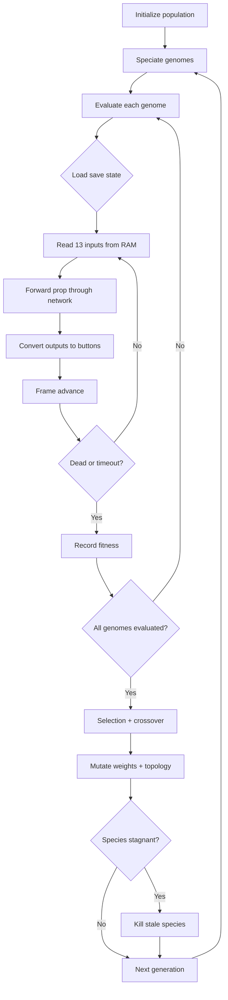

# NEAT Neuroevolution + Level Randomizer Plan

## Overview

Two new standalone Lua scripts for FCEUX:
1. **`lua/neat_evolve.lua`** -- NEAT (NeuroEvolution of Augmenting Topologies) that evolves neural networks to play SMB 1-1
2. **`lua/level_randomizer.lua`** -- Randomizes World 1-1 tile data in NES RAM to create training variety

Both run standalone in FCEUX (no Python needed), like `genetic_bruteforce.lua`.

---

## 1. NEAT Neuroevolution Script (`lua/neat_evolve.lua`)

### What NEAT Does Differently from the GA Brute Force

The GA brute force evolves *fixed sequences of button presses*. NEAT evolves *neural networks* that read game state and output button presses reactively. This means:
- GA genomes are level-specific (a winning genome for 1-1 won't work on 1-2)
- NEAT networks generalize -- they learn to react to obstacles, not memorize paths
- NEAT starts with minimal networks and adds complexity through mutation (topology evolution)

### Architecture

```
Inputs (13):                    Hidden (evolved):       Outputs (6):
  mario_x_vel      ----\                                  right
  mario_y_vel      ----+--->  [evolved topology]  --->    left
  on_ground        ----/      with variable nodes         jump (A)
  mario_y          ----/      and connections             run (B)
  closest_enemy_dx ----/                                  right+jump
  closest_enemy_dy ----/                                  right+jump+run
  pit_ahead        ----/
  tile_above       ----/
  tile_ahead_low   ----/
  tile_ahead_high  ----/
  tile_below       ----/
  time_remaining   ----/
  x_progress_pct   ----/
```

### NEAT-Specific Features

- **Genome = network topology** (connection list with innovation numbers, not button sequences)
- **Speciation** -- genomes grouped by topological similarity, prevents premature convergence
- **Complexification** -- starts with direct input->output connections, adds hidden nodes via mutation
- **Innovation tracking** -- global counter for new connections to enable meaningful crossover
- **Fitness sharing** -- within-species fitness is averaged to protect novel topologies

### NEAT Config

```lua
NEAT_CONFIG = {
    POPULATION_SIZE = 150,
    INPUT_COUNT = 13,
    OUTPUT_COUNT = 6,
    -- Mutation rates
    WEIGHT_MUTATE_RATE = 0.8,    -- chance of perturbing each weight
    WEIGHT_PERTURB = 0.1,        -- magnitude of weight perturbation
    ADD_NODE_RATE = 0.03,        -- chance of splitting a connection
    ADD_CONNECTION_RATE = 0.05,  -- chance of adding a new connection
    DISABLE_RATE = 0.04,         -- chance of disabling a connection
    -- Speciation
    EXCESS_COEFF = 1.0,          -- c1: excess gene distance weight
    DISJOINT_COEFF = 1.0,        -- c2: disjoint gene distance weight
    WEIGHT_COEFF = 0.4,          -- c3: weight difference distance weight
    SPECIES_THRESHOLD = 3.0,     -- delta threshold for same species
    STALE_SPECIES_GENS = 15,     -- kill species with no improvement
    -- Evaluation
    FRAME_SKIP = 4,
    TIMEOUT_FRAMES = 300,
    TARGET_X = 3160,
    MAX_GENERATIONS = 500,
    SAVESTATE_SLOT = 1,
}
```

### Evaluation Loop

Each genome is a neural network. For each frame:
1. Read 13 inputs from NES memory
2. Forward propagate through the evolved network
3. Convert 6 output activations to button presses (threshold > 0.5)
4. Fitness = max_x + completion_bonus + speed_bonus

### File Format

Save/load genomes as Lua tables with connection genes:
```lua
return {
    fitness = 3161,
    nodes = {1,2,3,...,19,20,21},  -- input + hidden + output IDs
    connections = {
        {from=1, to=14, weight=0.5, enabled=true, innovation=1},
        {from=2, to=14, weight=-0.3, enabled=true, innovation=2},
        ...
    }
}
```

### Key Differences from MarI/O (SethBling)

- Our input features are pre-extracted (velocity, enemy distance, pit detection) vs MarI/O's raw tile grid
- We use the same memory addresses already mapped in `mario_ai.lua`
- We save/load compatible with our existing `save_genome()`/`load_existing_genome()` pattern
- We integrate with the debug overlay for visualization

---

## 2. Level Randomizer Script (`lua/level_randomizer.lua`)

### Purpose

Randomize World 1-1 obstacles to create training variety for NEAT networks. This forces the neural network to generalize rather than memorize the specific layout.

### How It Works

SMB 1-1 level data is stored in ROM, but we can modify the RAM copy that NES loads. After the save state is loaded (before Mario starts moving), we patch specific RAM addresses to:
- Move/remove/add pipes
- Move/remove/add ground gaps (pits)
- Shuffle enemy spawn positions
- Modify platform heights

### Randomization Tiers

1. **Easy mode** -- only shuffle enemy positions, keep all terrain
2. **Medium mode** -- easy + move pipes left/right by 1-3 tiles
3. **Hard mode** -- medium + add/remove 1 pit, change staircase height
4. **Chaos mode** -- regenerate large sections of terrain from templates

### RAM Patching Approach

SMB stores the current screen's tile data at specific RAM ranges. The randomizer:
1. Loads save state (known good 1-1 start)
2. Reads current tile layout from RAM
3. Applies randomization patches
4. Creates a new save state with the modified layout
5. NEAT/GA evaluations use the randomized save state

### Integration

- Can be called from `neat_evolve.lua` before each generation to train on varied levels
- Can also be used standalone to generate random 1-1 variants for manual play
- Config option to control randomization intensity

---

## Implementation Order

1. **NEAT script first** -- this is the bigger feature and more directly useful
2. **Randomizer second** -- enhances NEAT training but is optional for basic NEAT

## Mermaid: NEAT Training Flow


