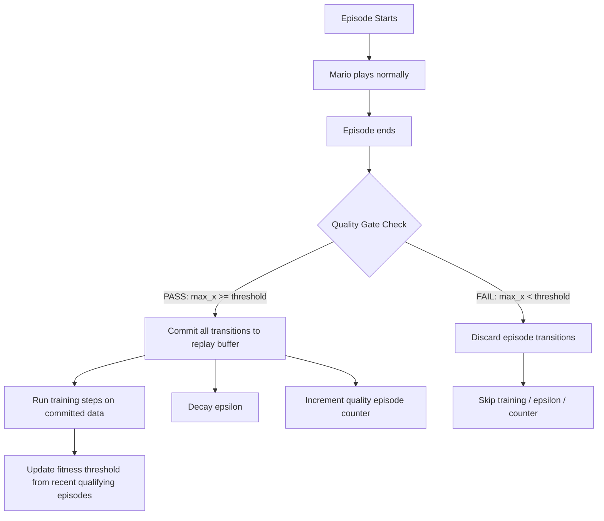

# Quality-Gated Training System

## Concept

Only train on episodes that meet a rising fitness threshold. Low-quality episodes still play (for data collection) but don't pollute the replay buffer, don't waste training steps, and don't burn epsilon decay budget.

---

## How It Works



### Threshold Formula

```python
threshold = max(
    200,                                          # Absolute floor
    percentile(last_100_qualifying_max_x, 25)     # Rising bar
)
```

### Override Conditions -- Always Qualify

Even below-threshold episodes qualify if:
1. `max_x >= session_best * 0.8` -- reached near-frontier territory
2. Episode is in warmup phase (first 50 episodes)
3. Threshold window has fewer than 20 qualifying episodes (cold start)
4. Episode number is divisible by 20 -- **periodic always-qualify** to maintain
   negative learning signal for early obstacles (mitigates Risk 6)

---

## Risks, Downsides, and Mitigations

### Risk 1: Forgetting How to Handle Early Obstacles

**Problem**: If the threshold rises to x=600, the agent stops training on x=0-600 data. But exploration (epsilon/NoisyNet) will still sometimes produce random actions in early sections. If the agent "forgets" how to navigate the first Goomba at x=300, it gets stuck dying early, which fails the quality gate, which means no training, which means it never re-learns -- a **death spiral**.

**Mitigation**: 
- The **25th percentile** is deliberately low -- it only filters the worst 25% of episodes. Even at the agent's best, most episodes will still start at x=0 and contain early-section data.
- The **0.8 * session_best override** ensures any episode reaching near the frontier always qualifies, even if it barely passed the early section.
- The **replay buffer retains old data** -- with 50K capacity and ~150 transitions per qualifying episode, ~333 episodes of history remain. Even if filtering blocks 50% of episodes, the buffer turns over in ~666 episodes, not instantly.

**Residual risk**: LOW. The buffer's persistence and the percentile-based threshold prevent runaway forgetting.

### Risk 2: Threshold Rises Too Fast

**Problem**: A few lucky episodes reach x=2000, pushing the 25th percentile threshold to x=800+. Now routine x=700 episodes get filtered, starving the buffer of intermediate-stage data.

**Mitigation**:
- Only qualifying episodes update the threshold window. This creates natural dampening -- if the threshold rises too fast and most episodes get filtered, the window stops updating, and the threshold stabilizes.
- The 25th percentile is conservative -- it would require 75%+ of qualifying episodes to exceed x=800 before the threshold reaches x=800.

**Residual risk**: LOW. The self-correcting property of percentile-on-qualifying-episodes prevents runaway escalation.

### Risk 3: Training Throughput Drops

**Problem**: If 50% of episodes get filtered, training steps per hour drops by 50% -- the GPU sits idle during filtered episodes.

**Mitigation**: 
- Filtered episodes are SHORT (3-10 seconds) because they die early. The time wasted is minimal.
- The alternative (training on junk data) is worse than not training at all -- it actively degrades the policy.
- Could add a **deferred training mode**: during filtered episodes, still run training steps using the existing replay buffer (no new data, just more passes over good data). This keeps GPU utilization high.

**Residual risk**: MEDIUM. Throughput will drop somewhat. The deferred training mode mitigates this but adds complexity. Recommend implementing deferred training as a v2 follow-up.

### Risk 4: Epsilon Decay Slows Down

**Problem**: Epsilon only decays on qualifying episodes. If only 50% of episodes qualify, epsilon reaches the floor in ~18,400 episodes instead of ~9,200. This means more random exploration for longer.

**Mitigation**: This is actually GOOD for learning -- the agent explores more during the phase where it's still learning basic behaviors. The epsilon floor (0.01) plus NoisyNet (5% floor) ensures there's always some randomness.

**Residual risk**: NONE -- this is a feature, not a bug.

### Risk 5: Bootstrap Problem -- Cold Start

**Problem**: At the very beginning, all episodes are low quality. If the threshold is too aggressive, nothing qualifies and the system never starts learning.

**Mitigation**:
- First 50 episodes ALWAYS qualify (warmup bypass)
- Threshold requires minimum 20 qualifying episodes before it activates
- Absolute floor of x=200 prevents threshold from going below a reasonable minimum

**Residual risk**: NONE with these safeguards.

### Risk 6: Loss of Negative Learning Signal

**Problem**: Filtering short death episodes removes data about what NOT to do. The agent needs to see "walking into a Goomba = death = bad reward" to learn avoidance.

**Mitigation**: This is the most subtle risk. However:
- Death data from QUALIFYING episodes is still stored. If the agent dies at x=700 (above threshold), that death is in the buffer.
- Early-section deaths (x=300) from qualifying episodes that happened to start badly but then recovered are still present.
- The NoisyNet + epsilon exploration ensures some qualifying episodes will include early-section deaths naturally.

**Residual risk**: LOW-MEDIUM. Worth monitoring. If the agent stops avoiding the first Goomba after extended training, this is the likely cause. Fix: add a periodic "always qualify" episode every 20 episodes regardless of score.

---

## Implementation Plan

### Architecture Change

Currently: transitions stored immediately during `_process_game_state_dict()`.  
New: transitions buffered in a temporary list, committed or discarded at `_end_episode()`.

### Files to Modify

**[`python/training/trainer.py`](../python/training/trainer.py)**
1. Add `_episode_transitions` temporary buffer (list of tuples)
2. In `_process_game_state_dict()`: append to temp buffer instead of `agent.store_experience()`
3. In `_end_episode()`: quality gate check, then commit or discard
4. Skip `agent.train_step()` during filtered episodes
5. Track qualifying episode count separately
6. Only call `agent.episode_end()` (which decays epsilon) for qualifying episodes

**[`config/training_config.yaml`](../config/training_config.yaml)**
```yaml
quality_gate:
  enabled: true
  percentile: 25              # Threshold percentile of qualifying episodes
  window_size: 100            # Rolling window of recent qualifying episodes
  min_qualifying: 20          # Minimum qualifying episodes before gate activates
  warmup_bypass_episodes: 50  # Always qualify during warmup
  floor_x: 200               # Absolute minimum threshold
  frontier_ratio: 0.8         # Qualify if max_x >= session_best * ratio
```

**No changes needed to**: dqn_agent.py, replay_buffer.py, reward_calculator.py, Lua scripts, neural network.

### Deferred Training (v2, not in initial implementation)

During filtered episodes, optionally run training steps on existing buffer data. This keeps GPU warm but risks overfitting on old data. Defer to v2 after measuring the throughput impact.

---

## Expected Impact

| Metric | Without Gate | With Gate |
|---|---|---|
| Junk transitions in buffer | ~40% | ~5% |
| Training steps on junk data | ~40% | 0% |
| Epsilon decay budget waste | ~40% | 0% |
| Buffer diversity | Low (dominated by 3s deaths) | High (only qualifying episodes) |
| Training throughput | 100% | ~60-70% (recoverable with deferred training) |
| Time to reach x=2000 | Baseline | Est. 30-50% faster (less noise) |
