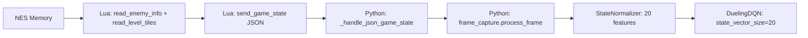

# State Vector Improvements for Hazard Avoidance

## Current State: The Agent Is Blind to Hazards

The current 12-feature state vector contains **zero information about enemies, pits, or obstacles**:

| # | Feature | Source | Usefulness |
|---|---------|--------|------------|
| 0 | mario_x_norm | position | [*] level progress |
| 1 | mario_y_norm | position | [*] jumping detection |
| 2 | mario_x_vel_norm | velocity | [*] momentum |
| 3 | mario_y_vel_norm | velocity | [*] jump arc |
| 4 | power_state_small | one-hot | [ ] rarely changes |
| 5 | power_state_big | one-hot | [ ] rarely changes |
| 6 | power_state_fire | one-hot | [ ] rarely changes |
| 7 | on_ground | boolean | [*] jump timing |
| 8 | direction | boolean | [*] facing |
| 9 | lives_norm | scalar | [ ] changes once per death |
| 10 | invincible | boolean | [ ] almost never true |
| 11 | level_progress | DUPLICATE of #0 | [ ] wasted feature |

The agent relies **entirely on 84x84 grayscale pixel frames** to detect enemies and pits -- which requires many thousands of episodes to learn through CNN features alone. Meanwhile, the Lua script **already reads** enemy positions, tile data, and threat assessments but doesn't include them in the JSON message sent to Python.

---

## Proposed: Expand to 20-Feature State Vector

Replace the 12-feature vector with a 20-feature vector that includes hazard information. The infrastructure for 20-feature mode already exists in the codebase -- [`preprocessing.py`](../python/utils/preprocessing.py) has `StateNormalizer(enhanced_features=True)` and the network config supports `state_vector_size: 20`.

### New 20-Feature Layout

| # | Feature | Source | Why It Helps |
|---|---------|--------|-------------|
| 0 | mario_x_norm | position | Level progress |
| 1 | mario_y_norm | position | Jump detection |
| 2 | mario_x_vel_norm | velocity | Momentum awareness |
| 3 | mario_y_vel_norm | velocity | Jump arc timing |
| 4 | power_state_small | one-hot | Power-up status |
| 5 | power_state_big | one-hot | Power-up status |
| 6 | power_state_fire | one-hot | Power-up status |
| 7 | on_ground | boolean | Jump timing |
| 8 | direction | boolean | Facing direction |
| 9 | lives_norm | scalar | Risk tolerance |
| 10 | invincible | boolean | Invincibility status |
| 11 | time_norm | scalar | **NEW** - Time pressure |
| 12 | closest_enemy_norm | scalar | **NEW** - Nearest enemy distance |
| 13 | enemy_count_norm | scalar | **NEW** - Active enemy count |
| 14 | threats_ahead | scalar | **NEW** - Enemies in front of Mario |
| 15 | threats_behind | scalar | **NEW** - Enemies behind Mario |
| 16 | pit_detected | boolean | **NEW** - Pit ahead |
| 17 | solid_tiles_ahead | scalar | **NEW** - Obstacles ahead |
| 18 | powerup_present | boolean | **NEW** - Power-up on screen |
| 19 | velocity_magnitude | scalar | **NEW** - Overall speed |

Key changes vs current 12:
- Removed duplicate `level_progress` (#11, identical to #0)
- Added `time_norm` (#11) -- agent needs to know time pressure
- Added 4 enemy/threat features (#12-15) -- the biggest improvement
- Added 2 terrain features (#16-17) -- pit and obstacle detection
- Added powerup_present and velocity_magnitude (#18-19)

---

## Data Flow: What Needs to Change



### Files to Modify

**1. [`lua/mario_ai.lua`](../lua/mario_ai.lua) -- `send_game_state()`**
Add enemy and tile data to the JSON message. The data is already collected by `extract_complete_game_state()`, it just needs to be serialized:
```lua
-- Add to parts table in send_game_state():
'"closest_enemy_dist":' .. (threats.closest_distance or 999),
'"enemy_count":' .. (threats.threat_count or 0),
'"threats_ahead":' .. (threats.threats_ahead or 0),
'"threats_behind":' .. (threats.threats_behind or 0),
'"pit_detected":' .. (has_pit and "true" or "false"),
'"solid_tiles_ahead":' .. solid_count,
'"powerup_present":' .. (powerup_on_screen and "true" or "false"),
```

**2. [`python/training/trainer.py`](../python/training/trainer.py) -- `_handle_json_game_state()`**
Parse the new JSON fields into the game_state dict:
```python
game_state = {
    # ... existing fields ...
    'closest_enemy_distance': data.get('closest_enemy_dist', 999.0),
    'enemy_count': data.get('enemy_count', 0),
    'threats_ahead': data.get('threats_ahead', 0),
    'threats_behind': data.get('threats_behind', 0),
    'pit_detected': data.get('pit_detected', False),
    'solid_tiles_ahead': data.get('solid_tiles_ahead', 0),
    'powerup_present': data.get('powerup_present', False),
    'velocity_magnitude': (data.get('mario_x_vel', 0)**2 + data.get('mario_y_vel', 0)**2)**0.5,
}
```

**3. [`python/utils/preprocessing.py`](../python/utils/preprocessing.py) -- `StateNormalizer`**
Replace the duplicate `level_progress` feature (#11) with `time_norm`, and add features 12-19. The enhanced_features=True path already has this layout -- we just need to switch it on.

**4. [`config/training_config.yaml`](../config/training_config.yaml)**
```yaml
network:
  state_vector_size: 20       # was 12
  enhanced_features: true      # was false
```

**5. [`python/utils/replay_buffer.py`](../python/utils/replay_buffer.py)**
Change `state_vector_size: 12` -> `state_vector_size: 20` in the buffer config.

**6. [`python/agents/dqn_agent.py`](../python/agents/dqn_agent.py)**
Change the hardcoded `state_vector_size: 12` in `_initialize_replay_buffer()`.

---

## Impact Assessment

### Breaking Change
This changes the neural network input dimension. Existing checkpoints from the 12-feature model **cannot be loaded** into a 20-feature model. Training must restart from scratch.

### Memory Impact
Negligible. 8 extra float32 values per entry = 32 bytes per replay buffer entry. At 50K entries = 1.6MB additional. The frame tensors at ~220KB/entry dominate.

### Training Impact
Positive. The agent will receive direct numerical signals about enemies and pits instead of trying to learn them from raw 84x84 pixels. This should dramatically speed up hazard avoidance learning.

### What This Does NOT Change
- Frame stack input (4x84x84) remains the same -- the CNN still processes visual input
- Action space (12 actions) remains the same
- Reward system remains the same
- Lua memory reading is already implemented -- we just expose the data

---

## Implementation Order

1. Config changes (training_config.yaml, network_config.yaml)
2. Lua JSON expansion (mario_ai.lua send_game_state)
3. Python JSON parsing (trainer.py _handle_json_game_state)
4. Preprocessing update (preprocessing.py StateNormalizer -- switch to enhanced mode)
5. Buffer + agent config (replay_buffer.py, dqn_agent.py)
6. Verify network accepts 20-feature input (dueling_dqn.py -- already parameterized)
