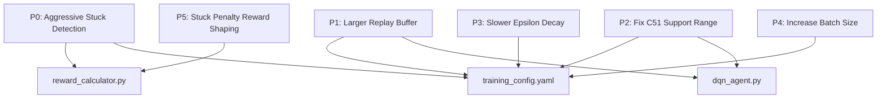

# Training Improvements Plan v4

Based on analysis of the 36.7-hour training run (session `20260317_225242`, 8,594 episodes).
See full analysis: [docs/TRAINING_ANALYSIS_20260317_225242.md](../docs/TRAINING_ANALYSIS_20260317_225242.md)

---

## Problem Summary

The agent plateaued around episode 2000-3000 and showed **no improvement for the remaining 6,000 episodes**. Three root causes:

1. **Stuck timeout episodes waste 44% of training time** -- Mario gets trapped at x=722 or x=898, oscillating for 30-65 seconds, flooding the replay buffer with useless zero-reward data
2. **Replay buffer too small** -- 20,000 capacity turns over every ~30 minutes, discarding rare good experiences
3. **Epsilon decayed too fast** -- Reached floor at episode 2,300, leaving 6,294 episodes with minimal exploration
4. **C51 support range too narrow** -- [-10, 10] compresses all n-step returns above 10 into the last atom

---

## Changes Overview



---

## P0: Aggressive Stuck Detection -- Largest Impact

**Why**: 15% of episodes last 30-65 seconds stuck at a pipe or gap. Each stuck episode generates 2000-3900 useless replay buffer entries. Over 8,594 episodes, this consumed ~16 hours and corrupted the replay buffer with zero-progress transitions.

**Current behavior** in [`reward_calculator.py:594`](../python/environment/reward_calculator.py:594):
```python
if self.frames_stuck > 1800:  # 30 seconds at 60 FPS
    return True, "stuck_timeout"
```

**Change**: Reduce from 1800 frames to 300 frames (5 seconds). Add a configurable `stuck_timeout_frames` parameter. Additionally, apply an escalating stuck penalty so the agent learns to avoid getting stuck in the first place.

### Files to modify

**[`config/training_config.yaml`](../config/training_config.yaml)** -- add stuck detection config:
```yaml
training:
  stuck_timeout_frames: 300       # 5 seconds at 60 FPS -- was 1800
  stuck_penalty_per_frame: -0.1   # Escalating penalty while stuck
  stuck_progress_threshold: 10    # Pixels of progress needed to reset counter
```

**[`python/environment/reward_calculator.py`](../python/environment/reward_calculator.py)** -- three changes:

1. Read `stuck_timeout_frames` from config instead of hardcoding 1800 (line 594)
2. Read `stuck_progress_threshold` from config instead of hardcoding 2 pixels (line 479)
3. Apply escalating stuck penalty in [`calculate_frame_reward()`](../python/environment/reward_calculator.py:261) when `frames_stuck > 60` (1 second grace period):
   - After 60 frames stuck: -0.1 per frame
   - This makes oscillation costly, teaching the agent to try different actions

**[`python/training/trainer.py`](../python/training/trainer.py)** -- pass stuck config from training_config through to the reward calculator during init (around line 188-189)

---

## P1: Increase Replay Buffer Size

**Why**: At 20,000 capacity with ~150 transitions per episode, the buffer holds only ~133 episodes -- turning over every ~30 minutes. Good experiences from rare long runs are quickly overwritten by short death episodes. Standard Rainbow papers use 1M; 200K is a reasonable improvement given RAM.

### Files to modify

**[`config/training_config.yaml`](../config/training_config.yaml:8)** -- change:
```yaml
replay_buffer_size: 200000  # was 20000
```

No code changes needed -- [`dqn_agent.py:161`](../python/agents/dqn_agent.py:161) already reads this from config. Memory impact: ~2-3GB additional RAM (acceptable -- current usage is ~680MB, GPU at 5.8GB).

---

## P2: Fix C51 Distributional Support Range

**Why**: With `reward_clip=10.0`, `n_step=3`, and `gamma=0.99`, the maximum n-step return is ~29.7. The current support [-10, 10] compresses all returns above 10 into a single atom, destroying the network's ability to distinguish good episodes from great ones. The v_min should also be more negative to cover death penalty sequences.

### Files to modify

**[`config/training_config.yaml`](../config/training_config.yaml:48-49)** -- change:
```yaml
v_min: -30.0   # was -10.0 -- covers death penalty chains
v_max: 50.0    # was 10.0  -- covers n-step returns from long episodes
```

No code changes needed -- [`dqn_agent.py:125-126`](../python/agents/dqn_agent.py:125) already reads these from config and passes them to the network.

---

## P3: Slower Epsilon Decay

**Why**: With `epsilon_decay=0.998` per episode, epsilon reached the 0.01 floor at episode ~2,300. That left 6,294 episodes (73% of training) at minimum exploration. The NoisyNet 5% floor helps but is insufficient for discovering genuinely new strategies at later obstacles.

### Files to modify

**[`config/training_config.yaml`](../config/training_config.yaml:15)** -- change:
```yaml
epsilon_decay: 0.9995  # was 0.998 -- reaches 0.01 at ~9200 episodes
```

No code changes needed -- [`dqn_agent.py:74`](../python/agents/dqn_agent.py:74) reads this from config, and [`_update_epsilon()`](../python/agents/dqn_agent.py:620) applies it per-episode.

---

## P4: Increase Batch Size

**Why**: GPU utilization is only 15-20% with batch_size=32. Increasing to 128 provides more stable gradients per update and better utilizes the available GPU memory (5.8GB used of likely 8-12GB available).

### Files to modify

**[`config/training_config.yaml`](../config/training_config.yaml:7)** -- change:
```yaml
batch_size: 128  # was 32
```

No code changes needed -- [`dqn_agent.py:61`](../python/agents/dqn_agent.py:61) reads this from config.

---

## P5: Escalating Stuck Penalty in Reward Shaping

This is implemented as part of P0 above. The key insight is that the **reward signal** must teach the agent to avoid stuck states, not just the episode termination. Currently, being stuck at x=722 for 30 seconds generates zero reward transitions -- the agent learns nothing negative about oscillation because the per-frame reward is 0.0 (no forward progress, no backward movement).

**Change in [`reward_calculator.py:calculate_frame_reward()`](../python/environment/reward_calculator.py:261)**:

After the existing stuck counter update at line 326, add:
```python
# Escalating stuck penalty after 1-second grace period
if self.frames_stuck > 60:
    excess_frames = self.frames_stuck - 60
    components.stuck_penalty = -0.1 * min(excess_frames, 240)  # caps at -24.0
```

This means:
- First 60 frames stuck (1 second): no penalty -- allows short pauses for jumps
- Frames 61-300 (1-5 seconds): -0.1 per frame, escalating to -24.0
- Episode terminates at frame 300 (from P0)

The `RewardComponents` dataclass already has a [`stuck_penalty`](../python/environment/reward_calculator.py:44) field, so no structural changes needed.

---

## Implementation Order

These changes are largely independent and can be done in one pass:

1. **Config changes** (training_config.yaml) -- all 5 items in one edit
2. **Reward calculator** (reward_calculator.py) -- stuck detection + penalty changes
3. **Trainer** (trainer.py) -- pass stuck config to reward calculator

No changes needed to: dqn_agent.py, episode_manager.py, dueling_dqn.py, replay_buffer.py, or any Lua files.

---

## Expected Impact

| Metric | Current | Expected After Changes |
|---|---|---|
| Time wasted on stuck episodes | ~16 hours per 36h run | ~2 hours per 36h run |
| Replay buffer diversity | ~133 episodes | ~1333 episodes |
| Epsilon reaches floor | Episode 2,300 | Episode 9,200 |
| GPU utilization | 15-20% | 40-60% |
| C51 distinguishable return range | [-10, 10] | [-30, 50] |

---

## What This Plan Does NOT Address

These are lower-priority items for future consideration:

- **Frame desync errors** -- 8,575 FRAME_DESYNC events in debug log. Needs Lua-side investigation
- **Learning rate scheduling** -- Currently fixed at 0.00025. Could benefit from cosine annealing
- **Reward function redesign** -- The current distance-based reward is adequate but could be improved with curiosity-driven exploration
- **Checkpoint resume** -- Should start from the best checkpoint of the previous run rather than from scratch
